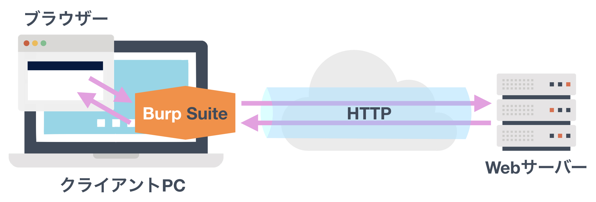
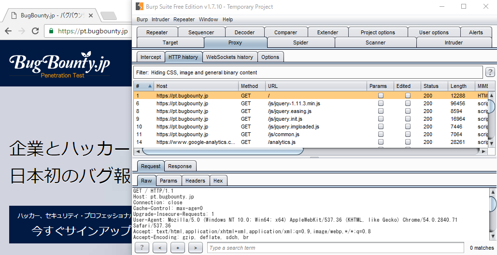
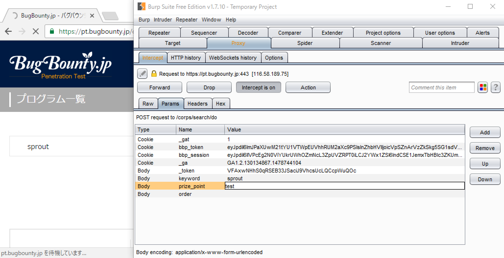
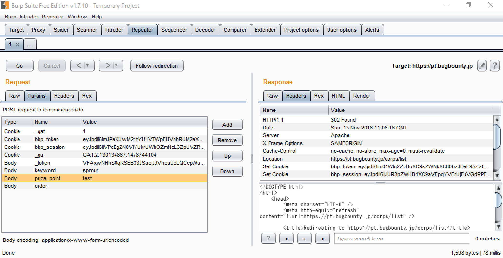

# Webアプリケーションへの入力値を操作しよう

第4回目はHTTP通信の書き換えによるWebアプリケーションへの入力値操作を説明します。

ブラックボックスでの脆弱性調査における「入力値」は、ブラウザ上のフォームへ入力する値だけではありません。HTTPのリクエストに含まれるパスやパラメータ、ヘッダの値全てが、Webアプリケーションで入力値として処理される可能性があります。そのためリクエストの内容を直接書き換えなければ、充分な調査は行なえません。

## HTTP通信に介入するツール

そこで「[Burp Suite](https://portswigger.net/burp)」を使います。これはブラウザとWebサーバー間の通信に介入し、通信内容の参照や書き換えを行なうツールです。

Burp Suiteには無償版と有償版があります。手動での調査であれば無償版でも充分に行なえるため、この連載では無償版を使います。また、Burp Suiteの愛好家団体である「[Burp Suite Japan User Group](https://twitter.com/burpsuitejapan)」から日本語の[スタートアップマニュアル](https://github.com/burpsuitejapan/startup/blob/master/startup_manual.pdf)が提供されています。こちらを参考にダウンロードとインストール、ブラウザでのプロキシ設定を行ないましょう。

マニュアルではjarファイルからの起動方法を説明していますが、exeファイルなどのインストーラーを使えばアイコンをダブルクリックするだけで簡単に起動できます。Javaのインストールも不要なため、入門者にはインストーラーからのセットアップをおすすめします。

## HTTP通信のキャプチャ

セットアップを終えたら動作確認も兼ねて、Proxy機能を使ってみましょう。マニュアルの4.1、4.2を参考に、プロキシ設定を行なったブラウザからWebアプリケーションにアクセスして、通信をキャプチャできることを確認します。

BugBounty.jpではプラットフォーム自身をバグバウンティの対象としており、脆弱性調査用の検証環境を公開しています。今回はそこにアクセスして通信をキャプチャしてみましょう。検証環境のURLは以下です。

hxxps://pt.bugbounty.jp/

このサイトはHTTPSで提供されているため、アクセスした際にブラウザ上でセキュリティ警告画面が表示されると思います。マニュアルの4.3.3を参考に、Burp Suiteが発行したCA証明書をインポートしてください。また、起動時はインターセプトが有効になっており、Burp Suiteによって通信が止められている状態です。\[Proxy\] - \[Intercept\] の \[Intercept is on\] をクリックして \[Intercept is off\] にすることで、通信が流れて図2のようにキャプチャできます。

## HTTP通信の書き換え

キャプチャしたリクエストを見ると、様々な数値や文字を送信しているのが分かると思います。マニュアルの4.2.2を参考に、これらの値を書き換えてみましょう。

BugBounty.jpのプログラム一覧画面から検索を行なった際のリクエストでは、ブラウザ上から入力したフリーワード以外にもパラメータで値を送信しています。このリクエストをインターセプトして、パラメータ `prize_point` の値を図3のように書き換えて送信します。

この操作により「報酬形態に不正な値が指定されています」というエラーメッセージが表示されます。予期しない値が入力された場合はエラーとしているのでしょう。

しかし、このパターンを試しただけでバグは無いと判断するのは惜しいです。記号を入力したら？もっと大きな数値を入力したら？マイナスの値は？小数点の値は？など、バグを見つけ出すには他にも試すべきパターンがあります。いくつものパターンを試す際に毎回ブラウザから操作を行ない、リクエストをインターセプトして書き換えるのでは手間がかかります。

## リクエストの再送信

そこでRepeater機能が役立ちます。これはBurp Suiteからリクエストを再送信できる機能です。マニュアルの4.3.1を参考に、先ほどのリクエストを \[Proxy\] - \[HTTP history\] から選択して再送信してみましょう。

再送信したリクエストに対するレスポンスを見ると、先ほどのエラーメッセージは含まれておらず302 Foundが返ってきています。このサイトではエラーが発生した場合、リダイレクトを挟んでエラーメッセージを表示しているようです。リダイレクト後のレスポンスを確認したい場合は、\[Repeater\] メニュー - \[Follow redirections\] から \[On-site only\] または \[Always\] を選択します。Scope設定（マニュアル 4.3.2）を行なっている場合は \[In-scope only\] を選択しても構いません。

![&#x56F3;5. Repeater&#x6A5F;&#x80FD;&#x306E; \[Follow redirections\] &#x3092;&#x8A2D;&#x5B9A;](../.gitbook/assets/e4_figure5.png)

Repeater機能を使えばブラウザを介さずに入力値を操作できるため、調査時間を短縮できます。バグバウンティでは他のハッカーより先に脆弱性を見つけなければならないため、このような機能を活用して効率よく調査を行ないましょう。

この他にもBurp Suiteには脆弱性調査に役立つ様々な機能があります。一例として、Intruder機能（マニュアル 4.3.6）を使うことで、短時間で大量のパターンを機械的に送信できます。しかし、この機能はサーバー側の処理に負荷をかけてしまう恐れがあります。より効率的な調査が可能であったとしてもルールを無視してはいけません。

Proxy機能とRepeater機能を使えば大抵の脆弱性は見つけられます。これで準備は整いました。

次回からはWebアプリケーションの様々な脆弱性を取り上げ、その見つけ方を紹介していきます。

