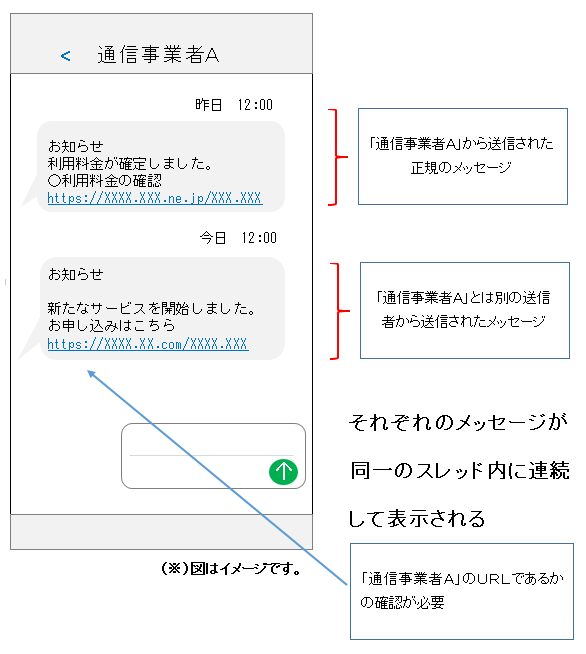
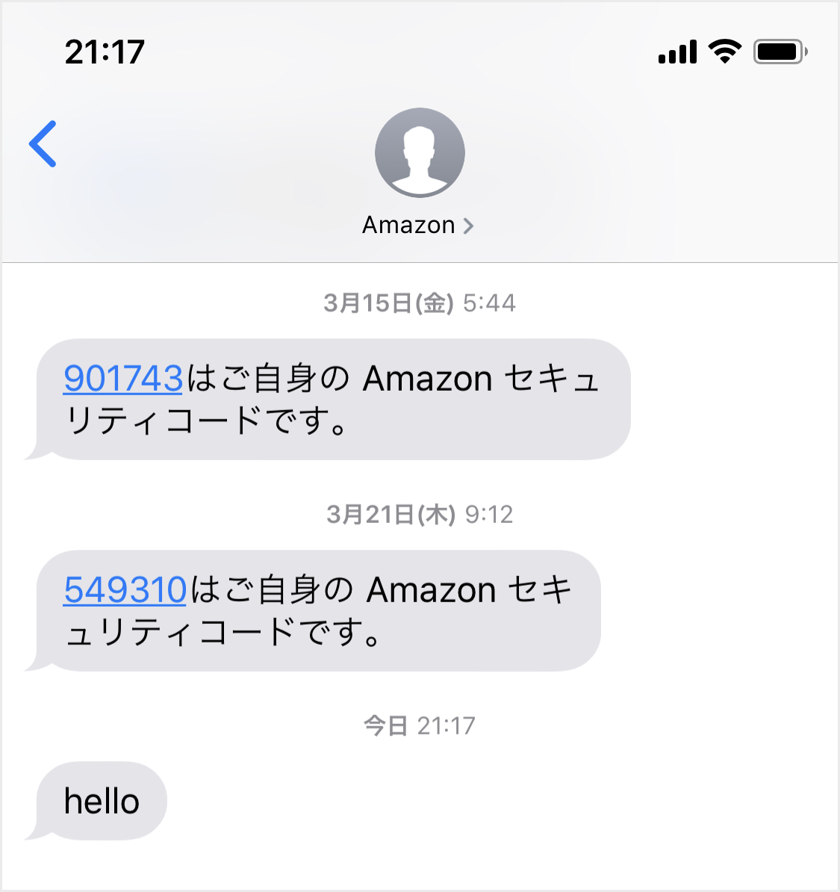
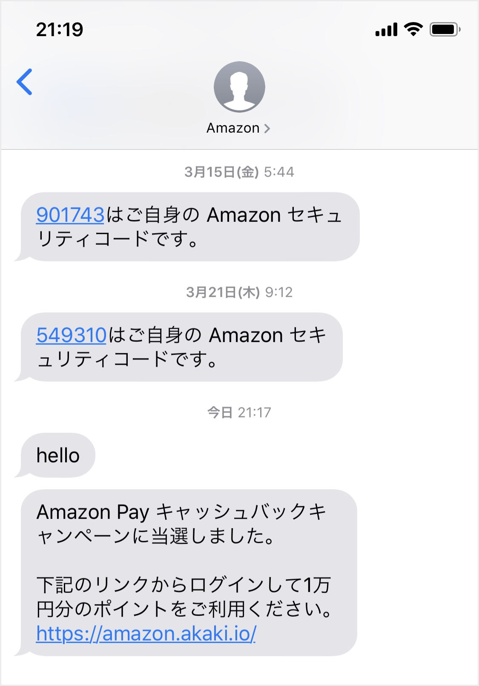
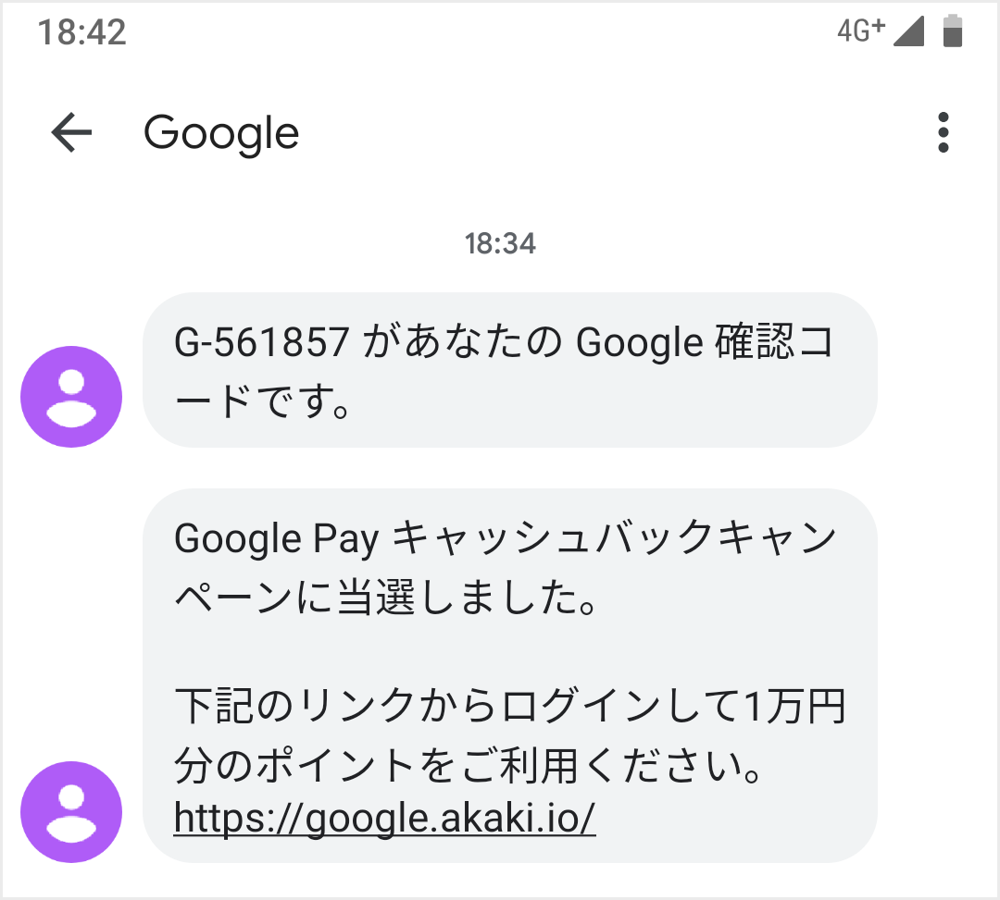
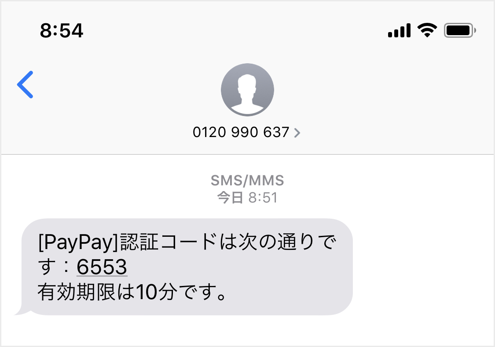
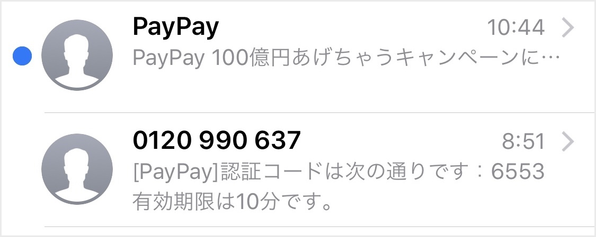
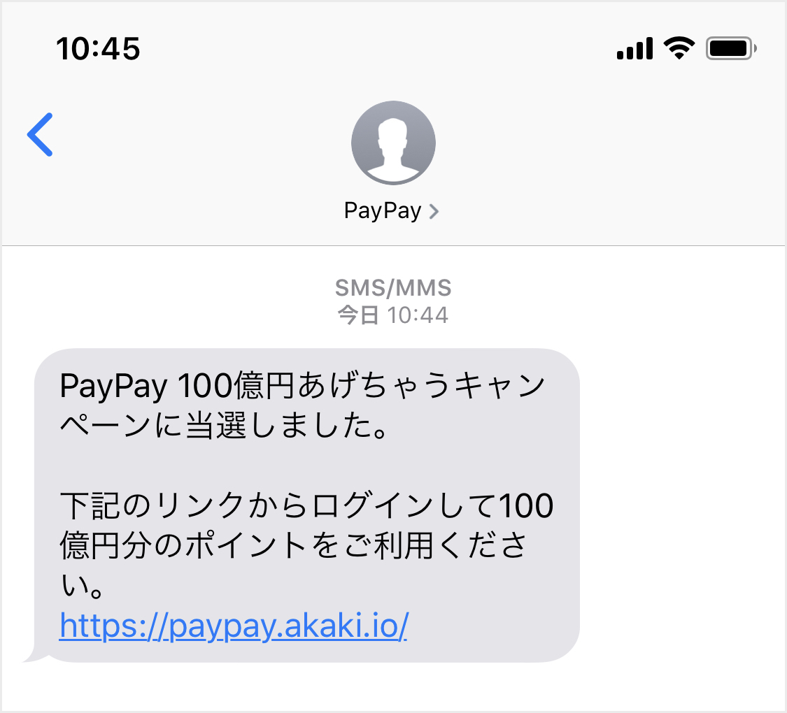
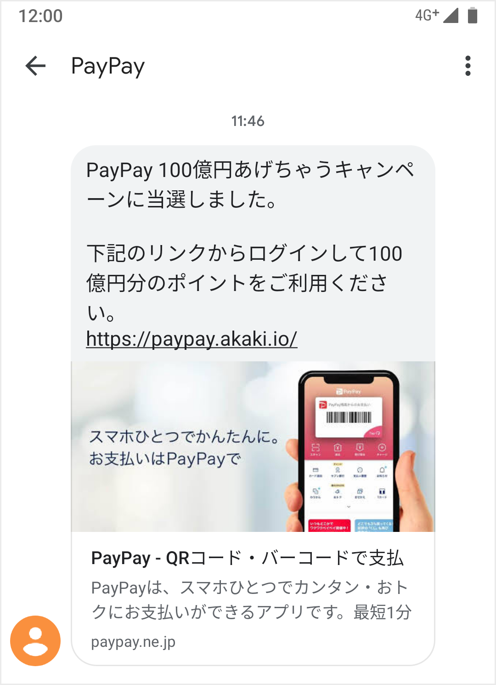

# SMSで送信元を偽装したメッセージを送る

サイバー犯罪に詳しい[@ozuma5119](https://twitter.com/ozuma5119)氏からスミッシングというフィッシング詐欺の手口を教えてもらった。「スミッシング（Smishing）」とは、SMSを悪用したフィッシング詐欺の呼称で、「SMS」と「Phishing」を組み合わせた造語である。日本国内では通信事業者や宅配業者を装ったスミッシングが多発しており、2019年6月にはJC3（日本サイバー犯罪対策センター）が「[通信事業者を騙るスミッシング詐欺の手法に係る注意喚起](https://www.jc3.or.jp/topics/smscert.html)」を行なっている。

JC3の注意喚起では、以下の図を用いて「SMSの送信元を偽装したメッセージが正規の送信者のスレッドに届く」と説明している。



普段から何の疑いもなくSMSを利用していた私は驚愕した。正規のスレッドにフィッシングメッセージが入ってくるなんて。注意喚起を読んだだけでは信じられなかったので、クラウド電話サービス「Twilio」を利用して実際に試してみる。なおTwilioの利用規約では送信元を偽装して他者を欺く行為を禁止しているため¹、検証は私が所有する以下の環境で行なう。

| OS | デバイス | SMSアプリ | 回線 |
| :---: | :---: | :---: | :---: |
| iOS 12.4 | iPhone 8 | メッセージ | SoftBank |
| iOS 12.4 | iPhone XS | メッセージ | NTT DOCOMO |
| Android 9 | Pixel 3a | メッセージ | NTT DOCOMO |

## 送信元表記が送信者IDのケース

SMSのメッセージを受信した際に表示される送信元には、電話番号の代わりに任意の英数字も表記できる。この英数字の送信元表記を「送信者ID（Sender ID）」という。JC3の図では `通信事業者Ａ` が送信者IDに当たる。

なお送信者IDの利用可否は受信側の通信事業者の対応状況によって異なる。Twilioの販売パートナーであるKWCの説明によると、日本国内ではNTT DOCOMOとSoftBankが送信者IDに対応し、KDDIは対応していないとのこと²。私はKDDIの回線を所有していないため、受信側がKDDIの電話番号を使用している場合の挙動は検証できていない。

まずはiOSの公式メッセージアプリに届いていたAmazonからのメッセージのスレッドで偽装を試みる。送信者IDは `Amazon` となっているため、TwilioでSMSを送信する際のFromの値に `Amazon` を指定する。

```text
curl -X POST https://api.twilio.com/2010-04-01/Accounts/{$ACCOUNT_SID}/Messages.json \
--data-urlencode "From=Amazon" \
--data-urlencode "Body=hello" \
--data-urlencode "To=$IPHONE_NUMBER" \
-u $ACCOUNT_SID:$AUTH_TOKEN
```



Twilioから送信したメッセージ「hello」が正規のスレッドに含まれた。JC3の説明は本当だった。日本語やURLリンクを含めた現実的なフィッシングメッセージの送信も試みる。Curlでは長文のメッセージが送りづらかったので、TwilioのPythonモジュールを使用してメッセージを送る。

```python
import os
from twilio.rest import Client

account_sid = os.environ.get('ACCOUNT_SID')
auth_token = os.environ.get('AUTH_TOKEN')
client = Client(account_sid, auth_token)

message = client.messages.create(
    body=("Amazon Pay キャッシュバックキャンペーンに当選しました。\n\n"
          "下記のリンクからログインして1万円分のポイントをご利用ください。\n"
          "https://amazon.akaki.io/"),
    from_='Amazon',
    to=os.environ.get('IPHONE_NUMBER')
)
```



URLリンクを含んだ日本語のメッセージも送信できた。Androidの公式メッセージアプリでも同様に送信元の偽装を試みる。Googleからのメッセージの送信者IDである `Google` をFromの値に指定すると、送信したメッセージが正規のスレッドに含まれた。



なお当初はAmazonではなくAppleのスレッドでの実証を予定していたが、Fromの値に `Apple` を指定すると[Error 21212](https://www.twilio.com/docs/errors/21212)が発生した。Fromの値を `Applo` に変更するとメッセージを送信できるため、Twilio側で特定の送信者IDの指定を禁止していると推測する。

```text
$ curl -X POST https://api.twilio.com/2010-04-01/Accounts/{$ACCOUNT_SID}/Messages.json \
> --data-urlencode "From=Apple" \
> --data-urlencode "Body=hello" \
> --data-urlencode "To=$IPHONE_NUMBER" \
> -u $ACCOUNT_SID:$AUTH_TOKEN
{"code": 21212, "message": "The 'From' number Apple is not a valid phone number, shortcode, or alphanumeric sender ID.", "more_info": "https://www.twilio.com/docs/errors/21212", "status": 400}
```

## 送信元表記が電話番号のケース

送信元が電話番号で表記されているスレッドにも偽装したメッセージを含められるのか。スーパーコールフリー番号が送信元になっているPayPayからのメッセージのスレッドで偽装を試みる。



送信元の電話番号である `0120 990 637` をFromの値に指定すると[Error 21212](https://www.twilio.com/docs/errors/21212)が発生する。Fromの値にスペースを含めたのが原因と考え、国番号を追加した `+81120990637` に変更するとエラーコードが変化する。新たに発生した[Error 21606](https://www.twilio.com/docs/api/errors/21606)の解説によると、Twilioはスパム対策のためアカウントに紐付いていない電話番号をFromの値に指定できない仕様であった。

```text
$ curl -X POST https://api.twilio.com/2010-04-01/Accounts/{$ACCOUNT_SID}/Messages.json \
> --data-urlencode "From=+81120990637" \
> --data-urlencode "Body=hello" \
> --data-urlencode "To=$IPHONE_NUMBER" \
> -u $ACCOUNT_SID:$AUTH_TOKEN
{"code": 21606, "message": "The From phone number +81120990637 is not a valid, SMS-capable inbound phone number or short code for your account.", "more_info": "https://www.twilio.com/docs/errors/21606", "status": 400}
```

Twilioを利用した検証では、送信元の電話番号を偽装して正規のスレッドにメッセージを含めることはできなかった。しかし正規のスレッドに含めることを目的としなければ、独自に送信者IDを指定するだけで偽装したメッセージを送れる。送信者IDを `PayPay` と指定すればPayPayからの公式メッセージを装える。





iOSとAndroidの公式メッセージアプリには、メッセージ内のURLリンクを画像やタイトルを含んだリンクに置き換えるリンクプレビュー機能が搭載されている。iOSでは連絡先に登録していない送信元からのメッセージだとプレビューが機能しなかった。しかしAndroidではアプリの設定で自動プレビューが有効になっていると、連絡先に登録していない送信元であってもプレビューが機能した。プレビューを読み込むと正規サイトとの共通点が増えるため、異変に気づきにくくなる。



## 所感

私は今までLINEと同じ感覚でSMSを利用していたので、正規のスレッドに偽装されたメッセージが届くとは考えもしなかった。もし巧妙に偽装されたフィッシングメッセージが届いていたら、異変に気づけなかっただろう。従来のメールには無い、チャット特有のスレッド表示を無意識に信用してしまっていた。被害に遭う前にこのような仕様に気づけたのは幸いだったが、SMS利用者としてもっと早く知っておくべきだった。フィッシング詐欺の傾向への日々の注意は欠かせないと実感した。

Twilioを利用した検証では、送信元表記が電話番号になっているスレッドにはメッセージを含められなかった。しかし送信者IDを偽装するだけでも充分脅威になり得る。実際に2018年7月頃から発生している宅配業者を装ったスミッシングでは、SMSでの不在通知を行なっていない宅配業者に偽装したメッセージで多くの被害が出ている³。今後はSMSのメッセージが届いたら、まず疑ってかかるよう意識したい。


¹ [https://www.twilio.com/legal/aup](https://www.twilio.com/legal/aup)  
² [https://twilioforkwc.zendesk.com/hc/ja/articles/360000013181](https://twilioforkwc.zendesk.com/hc/ja/articles/360000013181)  
³ [https://www.ipa.go.jp/security/anshin/mgdayori20181129.html](https://www.ipa.go.jp/security/anshin/mgdayori20181129.html)

