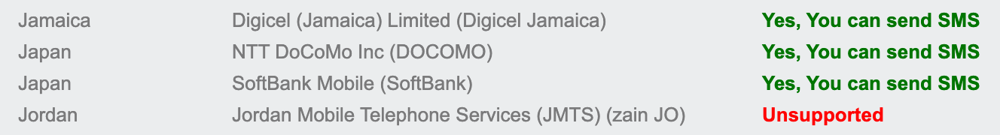
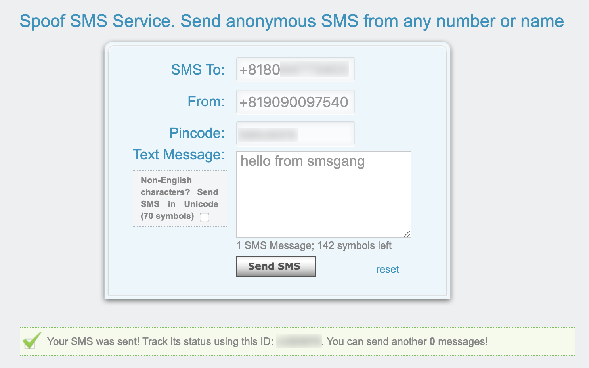
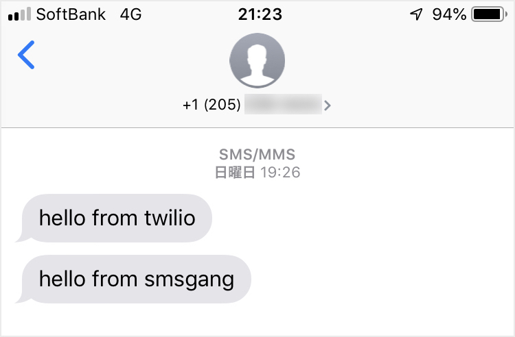
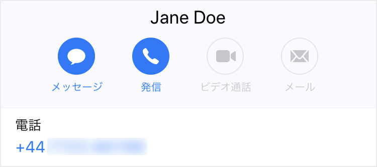
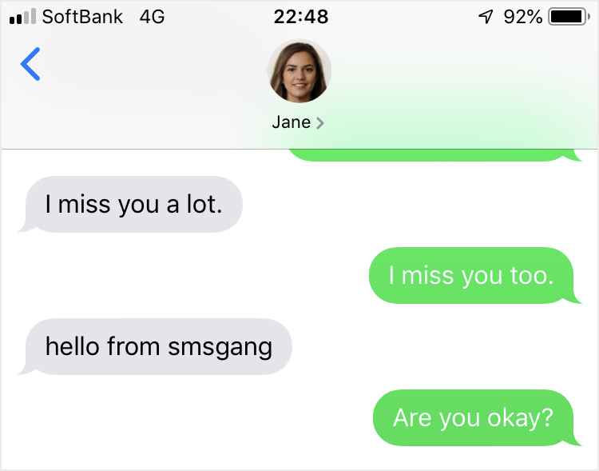
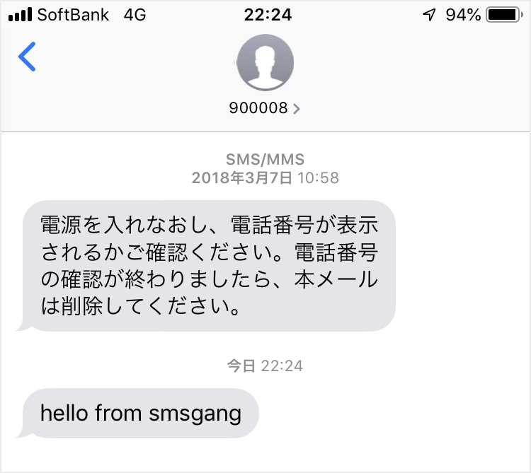
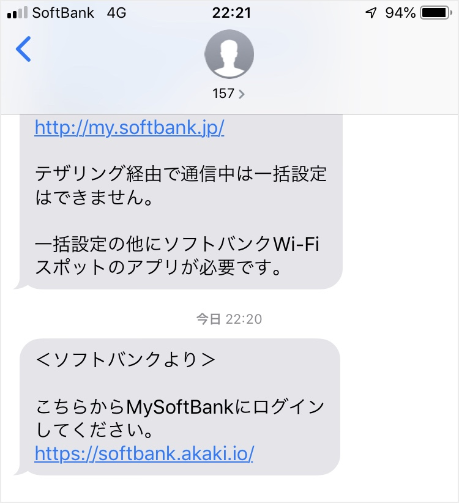
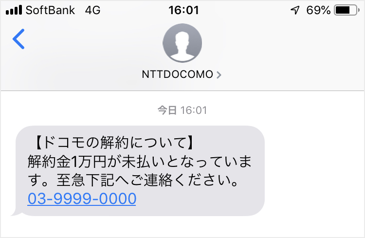

# SMSで送信元の電話番号を偽装したメッセージを送る

[前回の記事](sms_spoofing.md)ではクラウド電話サービス「Twilio」を利用してSMSの送信元を偽装した。ただしTwilioはアカウントに紐付いていない電話番号をFromの値に指定できないため、送信元の電話番号を偽装したメッセージは送れなかった。別のクラウド電話サービスである「Nexmo」でも試したが、Fromの値が数値の場合は `+852` から始まる香港番号に変換され、任意の番号には偽装できなかった¹。

SMSの偽装について調べていくと、電話番号を偽装したSMSを送信できると主張するWebサービスがいくつか見つかる。その中から「[SMSGang](https://www.smsgang.com)」というサービスを利用してメッセージを送信すると、宛先の電話回線によって受信の可否が分かれた。以下の個人環境で検証した結果を示す。

| OS | デバイス | SMSアプリ | 回線 |
| :---: | :---: | :---: | :---: |
| iOS 12.4.1 | iPhone 8 | メッセージ | SoftBank |
| iOS 13.1.1 | iPhone XS | メッセージ | NTT DOCOMO |
| Android 10 | Pixel 3a | メッセージ | KDDI |

## SMSGangによる電番偽装

SMSGangから偽装したメッセージを送るには事前にPINコードを購入する必要がある。テストメッセージは無料で送信できるため、デバイスで受信できることを確認してからPINコードを購入したい。SMSGangがサポートしている通信事業者を確認すると、日本ではDOCOMO回線とSoftBank回線が対象になっている。

SoftBank回線の電話番号宛に送信したテストメッセージはデバイスで正常に受信できたが、DOCOMO回線の番号では受信できない。KDDI回線の番号でも確認したが受信できない。PINコードの購入後に再検証したが、SMSGangから送信したメッセージをDOCOMO回線とKDDI回線では受信できなかった。そのため以降で示す挙動は全てSoftBank回線で実証したものである。この挙動は既に[SoftBank CSIRT](https://www.nca.gr.jp/member/softbank-csirt.html)へ報告し、現在は再現しなくなっている。


ソフトバンクから注意喚起が行なわれている。 [https://www.softbank.jp/mobile/info/personal/news/support/20200304a/](https://www.softbank.jp/mobile/info/personal/news/support/20200304a/)


### 国内番号への偽装

宛先となるToの値にSoftBank回線の電話番号を、Fromの値にはAmazonの2段階認証で使用されていた `09090097540` を国際形式で入力し、有効なPINコードと共にメッセージを送る。

フォーム上にはメッセージを送信した旨が表示される。しかしデバイスではメッセージを受信できない。送信履歴に表示されたステータスは `FAILED` になっている。

Fromの値を `090` から始まる国内形式に変更しても送信ステータスは `FAILED` になる。その他にも `+8190` 以外の携帯番号や東京の市外局番、スーパーコールフリー番号も確認したが、全て `FAILED` になり国内番号への偽装は実証できなかった。

### 国際番号への偽装

Twilioで取得した `+1` から始まる米国番号をFromの値に指定すると、送信ステータスは `DELIVERED` になりデバイスでもメッセージを受信できた。

送信元の電話番号を偽装したメッセージは、Twilioから送信した正規のメッセージと同じスレッドに含まれる。

Twilioで取得した `+44` から始まる英国番号にも偽装できた。電話番号を連絡先に登録した状態でも偽装したメッセージは正規のスレッドに含まれる。そのため連絡先に登録している海外の知人とのやり取りの中にフィッシングメッセージが入ってくる状態だった。

SMSGangから電話番号を偽装したメッセージに対する返信は正規の番号に送られる。そのため上記スレッドでの `Are you okay?` という返信はTwilioの番号に届く。Janeになりすました状態では被害者とやり取りできないため、攻撃者が被害者とのコミュニケーションを望む場合は被害者を別の連絡手段に誘導する必要があった。

### ショートコードへの偽装

通常の電話番号より短い桁数で構成されるショートコードにも偽装できた。SoftBank回線を初期設定した際の通知で使用されていた `900008` という6桁の番号に偽装している。

### 問い合わせ特番への偽装

ソフトバンクの総合案内で使用されている `157` という問い合わせ特番にも偽装できた。この番号からMy SoftBankへのログイン情報やセキュリティ番号が通知されるため、ソフトバンクの利用者を狙ったスミッシングに悪用される恐れがあった。

## 送信者ID制限の回避

2019年6月に発生したドコモをかたるスミッシングでは `NTT DOCOMO` という送信者IDが使用された²。TwilioとNexmoではFromの値に `NTTDOCOMO` を指定したメッセージの送信処理は成功するが、通信事業者側での配送エラーにより全ての電話回線で受信できない。1文字違いの `NTTDOCOCO` はKDDIを含む全ての回線で受信できることから、現在は通信事業者各社が `NTTDOCOMO` への偽装を禁止していると推測する。

しかし送信者IDを `NTTDOCOMO` に偽装したメッセージをSMSGangから送信するとSoftBank回線のデバイスで受信できた。ドコモからソフトバンクに乗り換えた利用者を標的としたフィッシングメッセージも送れる状態だった。

## 所感

今回取り上げたSMSGangによる偽装は、SoftBank CSIRTへ報告した5日後に再現しなくなった。SoftBank回線へのメッセージのみ `FAILED` するようになったため、私はソフトバンクが実施した対策によるものと考えた。しかしSoftBank CSIRTは対策を実施していないと言う。SMSGangによる何らからの措置によるものと推測する。

SMSGangは悪用できなくなったが、電話番号を偽装したSMSを送信できると主張するサービスは他にも存在する。そのため同様のスミッシングがSoftBank回線以外でも発生する可能性はある。また送信者IDの偽装においても `NTTDOCOMO` とは関係のない他のサービスには装えるため、`PayPay` をかたるスミッシングが再発する恐れもある³。

前回から示してきたスミッシングに対して利用者がとれる策としては、「SMSで送られてきたURLを踏まない」といった運用や、「海外からのSMSを拒否する」または「特定の国内番号からのSMSのみ許可する」といった設定が有効だと考える。しかしこのような対策はSMSの利便性を奪い、利用用途を限定してしまう。利用者の運用や設定に任せるだけでなく、通信事業者による抜本的な対策も求められる。ソフトバンクはフィッシング詐欺被害への補償制度を導入し⁴、スミッシングへの技術的対策も検討していくとのこと。今後も頻発するであろうスミッシングの根絶に向けた通信事業者各社の連携した対策に期待したい。

¹ [https://help.nexmo.com/hc/en-us/articles/204017353-Japan-SMS-Features-Restrictions](https://help.nexmo.com/hc/en-us/articles/204017353-Japan-SMS-Features-Restrictions)  
² [https://www.antiphishing.jp/news/alert/docomo\_20190621.html](https://www.antiphishing.jp/news/alert/docomo_20190621.html)  
³ [https://piyolog.hatenadiary.jp/entry/2019/09/10/070146](https://piyolog.hatenadiary.jp/entry/2019/09/10/070146)  
⁴ [https://www.softbank.jp/mobile/info/personal/news/service/20191105a/](https://www.softbank.jp/mobile/info/personal/news/service/20191105a/)

