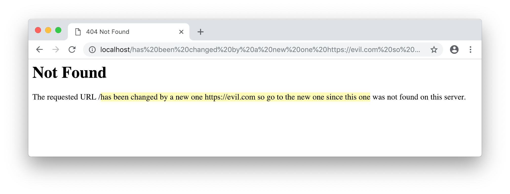
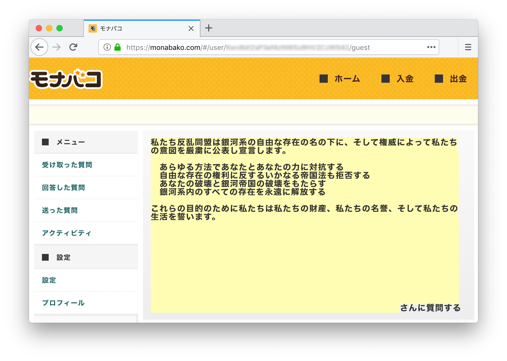
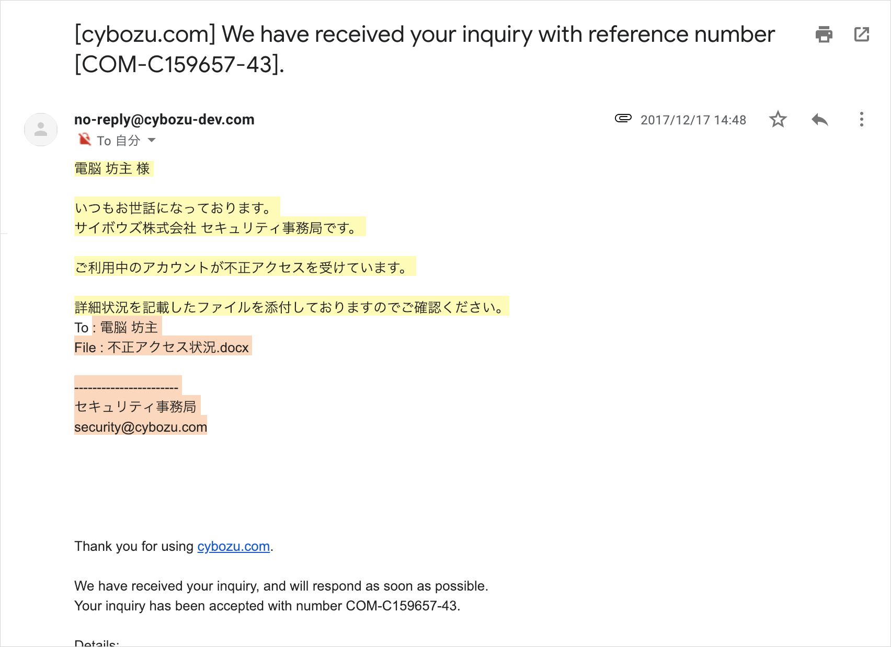
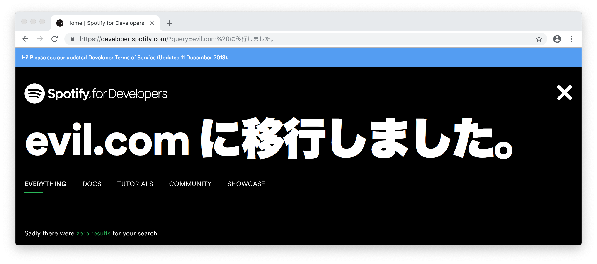
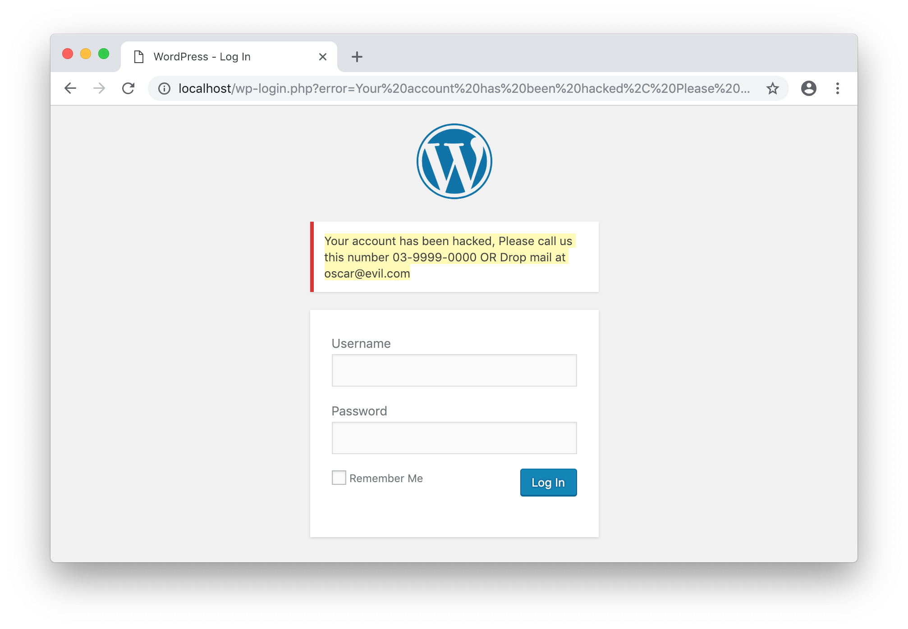

# 脆弱性報奨金制度で認定されづらいテキストインジェクション

これまでのエントリーでは脆弱性報奨金制度で認定された脆弱性を取り上げてきたが、今回は逆に認定されなかった脆弱性を取り上げる。私が過去に[モナバコ](https://web.archive.org/web/20190526035228/https://monabako.com/#/bugbounty)と[サイボウズ](https://cybozu.co.jp/products/bug-bounty/)へ報告し、認定対象外となったテキストインジェクションの詳細を振り返りながら、その脅威について考えていく。また最後にテキストインジェクションが脅威になり得る好事例も紹介する。

## テキストインジェクションとは

入力値として受け取った文字列をWebページなどに表示する動作において、本来は文章の書き込みを想定していない部分に任意の文章を挿入される脆弱性がテキストインジェクションである。OWASPでは[コンテンツスプーフィング](https://www.owasp.org/index.php/Content_Spoofing)の一種とされている。

攻撃者によって書き換えられた文章を読んだ被害者が、その内容に従った場合に実害が生じる。HackerOneで公開されているテキストインジェクションのレポートの多くはApacheの標準404ページに表示される文章を書き換えている。例えば[\#134388](https://hackerone.com/reports/134388)では「指定のURLは見つからなかった」という趣旨のエラーメッセージを、以下のように「指定のURLは `evil.com` へ変更になった」という趣旨に書き換えている。

hxxps://example.com/has%20been%20changed%20by%20a%20new%20one%20hxxps://evil.com%20so%20go%20to%20the%20new%20one%20since%20this%20one



`/` 以降の黄色い部分が追記された文章である。本来は存在しないパスが表示される部分に、文章として成り立つような文字列を挿入している。この例ではパスからの入力により文章を挿入しているが、パラメータの値から挿入できるケースも当然ある。私が過去に報告した挙動もPOSTリクエストでの入力値が表示される部分に存在していた。

## 認定対象外となった事例

### モナバコに表示されるプロフィール名での例

モナバコのアカウントにはTwitterアカウントと同様のプロフィール名とアイコン画像が設定される。設定時のAPIリクエストを操作することで、アイコン画像では[401インジェクション](../2018/401i_in_monabako.md)が、プロフィール名ではテキストインジェクションが可能であった。Twitterの表示名には[51文字以上を設定できない仕様](https://help.twitter.com/ja/managing-your-account/change-twitter-handle)だが、リクエスト上の `displayName` を以下のように操作すると51文字以上のプロフィール名を設定できる。

```diff
 POST /postOauthToken HTTP/1.1
 Host: api.monabako.com
 ...

-{"token":"98 ... PM","secret":"xI ... sL","photoURL":"https://abs.twimg.com/sticky/default_profile_images/default_profile_normal.png","displayName":"Akaki Tsunoda"}
+{"token":"98 ... PM","secret":"xI ... sL","photoURL":"https://abs.twimg.com/sticky/default_profile_images/default_profile_normal.png","displayName":"\u79c1\u305f\u3061\u53cd\u4e71\u540c\u76df\u306f\u9280\u6cb3\u7cfb\u306e\u81ea\u7531\u306a\u5b58\u5728\u306e\u540d\u306e\u4e0b\u306b\u3001\u305d\u3057\u3066\u6a29\u5a01\u306b\u3088\u3063\u3066\u79c1\u305f\u3061\u306e\u610f\u56f3\u3092\u53b3\u7c9b\u306b\u516c\u8868\u3057\u5ba3\u8a00\u3057\u307e\u3059\u3002\u3000\u3000\u3000\u3000\u3000\u3000\u3000\u3000\u3000\u3000\u3000\u3000\u3000\u3000\u3000\u3000\u3000\u3000\u3000\u3000\u3000\u3000\u3000\u3000\u3000\u3000\u3000\u3000\u3000\u3000\u3000\u3000\u3000\u3000\u3000\u3000\u3000\u3000\u3000\u3000\u3000\u3000\u3000\u3000\u3000\u3000\u3000\u3000\u3000\u3000\u3000\u3000\u3000\u3000\u3000\u3042\u3089\u3086\u308b\u65b9\u6cd5\u3067\u3042\u306a\u305f\u3068\u3042\u306a\u305f\u306e\u529b\u306b\u5bfe\u6297\u3059\u308b\u3000\u3000\u3000\u3000\u3000\u3000\u3000\u3000\u3000\u3000\u3000\u3000\u3000\u3000\u81ea\u7531\u306a\u5b58\u5728\u306e\u6a29\u5229\u306b\u53cd\u3059\u308b\u3044\u304b\u306a\u308b\u5e1d\u56fd\u6cd5\u3082\u62d2\u5426\u3059\u308b\u3000\u3000\u3000\u3000\u3000\u3000\u3000\u3000\u3000\u3000\u3000\u3042\u306a\u305f\u306e\u7834\u58ca\u3068\u9280\u6cb3\u5e1d\u56fd\u306e\u7834\u58ca\u3092\u3082\u305f\u3089\u3059\u3000\u3000\u3000\u3000\u3000\u3000\u3000\u3000\u3000\u3000\u3000\u3000\u3000\u3000\u3000\u3000\u9280\u6cb3\u7cfb\u5185\u306e\u3059\u3079\u3066\u306e\u5b58\u5728\u3092\u6c38\u9060\u306b\u89e3\u653e\u3059\u308b\u3000\u3000\u3000\u3000\u3000\u3000\u3000\u3000\u3000\u3000\u3000\u3000\u3000\u3000\u3000\u3000\u3000\u3000\u3000\u3000\u3000\u3000\u3000\u3000\u3000\u3000\u3000\u3000\u3000\u3000\u3000\u3000\u3000\u3000\u3000\u3000\u3000\u3000\u3000\u3000\u3000\u3000\u3000\u3000\u3000\u3000\u3000\u3000\u3000\u3000\u3053\u308c\u3089\u306e\u76ee\u7684\u306e\u305f\u3081\u306b\u79c1\u305f\u3061\u306f\u79c1\u305f\u3061\u306e\u8ca1\u7523\u3001\u79c1\u305f\u3061\u306e\u540d\u8a89\u3001\u305d\u3057\u3066\u79c1\u305f\u3061\u306e\u751f\u6d3b\u3092\u8a93\u3044\u307e\u3059\u3002\u3000\u3000\u3000\u3000\u3000\u3000\u3000\u3000\u3000\u3000\u3000\u3000\u3000\u3000\u3000\u3000\u3000\u3000\u3000\u3000\u3000\u3000\u3000\u3000\u3000\u3000\u3000\u3000\u3000\u3000\u3000\u3000\u3000\u3000\u3000\u3000\u3000\u3000\u3000\u3000\u3000\u3000\u3000\u3000\u3000\u3000\u3000\u3000\u3000\u3000\u3000\u3000\u3000\u3000\u3000\u3000\u3000\u3000\u3000\u3000\u3000\u3000\u3000\u3000\u3000\u3000\u3000\u3000\u3000\u3000\u3000\u3000\u3000\u3000\u3000\u3000\u3000\u3000\u3000\u3000\u3000\u3000\u3000\u3000\u3000\u3000\u3000\u3000\u3000\u3000\u3000\u3000\u3000\u3000\u3000\u3000\u3000\u3000\u3000\u3000\u3000\u3000\u3000\u3000\u3000\u3000\u3000\u3000\u3000\u3000\u3000\u3000\u3000\u3000\u3000\u3000\u3000\u3000\u3000\u3000\u3000\u3000\u3000\u3000\u3000\u3000\u3000\u3000\u3000\u3000\u3000\u3000\u3000\u3000\u3000\u3000\u3000\u3000\u3000\u3000\u3000\u3000\u3000\u3000\u3000\u3000\u3000\u3000\u3000\u3000\u3000\u3000\u3000\u3000\u3000\u3000\u3000\u3000\u3000\u3000\u3000\u3000\u3000\u3000\u3000\u3000\u3000\u3000\u3000\u3000\u3000\u3000\u3000\u3000\u3000\u3000\u3000\u3000\u3000\u3000\u3000\u3000\u3000\u3000\u3000\u3000\u3000\u3000\u3000\u3000\u3000\u3000\u3000\u3000\u3000\u3000\u3000\u3000\u3000\u3000\u3000\u3000\u3000\u3000\u3000\u3000\u3000\u3000\u3000\u3000\u3000\u3000\u3000\u3000\u3000\u3000\u3000\u3000\u3000\u3000\u3000\u3000\u3000\u3000\u3000\u3000\u3000\u3000\u3000\u3000\u3000\u3000\u3000\u3000\u3000\u3000\u3000\u3000\u3000\u3000\u3000\u3000\u3000\u3000\u3000\u3000\u3000\u3000\u3000\u3000\u3000\u3000\u3000\u3000\u3000\u3000\u3000\u3000\u3000\u3000\u3000\u3000\u3000\u3000\u3000\u3000\u3000\u3000\u3000\u3000\u3000\u3000\u3000\u3000\u3000\u3000\u3000\u3000\u3000\u3000\u3000\u3000\u3000\u3000\u3000\u3000\u3000\u3000\u3000\u3000\u3000\u3000\u3000\u3000\u3000\u3000\u3000\u3000\u3000\u3000\u3000\u3000\u3000\u3000\u3000\u3000\u3000\u3000\u3000\u3000\u3000\u3000\u3000\u3000\u3000\u3000\u3000\u3000\u3000\u3000\u3000\u3000\u3000\u3000\u3000\u3000\u3000\u3000\u3000\u3000\u3000\u3000\u3000\u3000\u3000\u3000\u3000\u3000\u3000\u3000\u3000\u3000\u3000\u3000\u3000\u3000\u3000\u3000\u3000\u3000\u3000\u3000\u3000\u3000\u3000\u3000\u3000\u3000\u3000\u3000\u3000\u3000\u3000\u3000\u3000\u3000\u3000\u3000\u3000\u3000\u3000\u3000\u3000\u3000\u3000\u3000\u3000\u3000\u3000\u3000\u3000\u3000\u3000\u3000\u3000\u3000\u3000\u3000\u3000\u3000\u3000\u3000\u3000\u3000\u3000\u3000\u3000\u3000\u3000\u3000\u3000\u3000\u3000\u3000\u3000"}
```

これにより本来プロフィール名が表示される部分に以下のような文章が表示される¹。改行はできないため全角スペース `\u3000` によりインデントを調整している。



攻撃者によって差別的表現や宗教的表現を含む文章を書き込まれ、そのページをSNSで拡散された場合にサービスのイメージ低下などの風評被害につながる恐れがあると報告したが、脆弱性として認定されなかった。評価理由についてモナバコは「本件は脆弱性ではなく運用の問題」と述べている。

### サイボウズから送信されるメールの宛名での例

cybozu.com共通管理のお問い合わせフォームでは、投稿時に指定したメールアドレス宛に受付メールが送信されており、メール本文には入力した宛名（所属組織と個人名）が含まれていた。そのため投稿時のリクエストを以下のように操作することで、メール本文に文章を追記できる状態だった。

```diff
 POST /api/support/question.json?_lc=en-US HTTP/1.1
 Host: ████████████████████.cybozu-dev.com
 Accept-Language: en-US;q=0.7,en;q=0.3
 ...

-{"type":"question","questionService":"garoon","questionFeature":"-","questionBody":"-","questionFile":"46 ... 37","commonCompany":"Paranoid","commonPerson":"Akaki Tsunoda","commonEmail":"█████████@gmail.com","__REQUEST_TOKEN__":"92 ... 58"}
+{"type":"question","questionService":"garoon","questionFeature":"-","questionBody":"-","questionFile":"46 ... 37","commonCompany":"\u96fb\u8133 \u574a\u4e3b \u69d8\r\n\r\n\u3044\u3064\u3082\u304a\u4e16\u8a71\u306b\u306a\u3063\u3066\u304a\u308a\u307e\u3059\u3002\r\n\u30b5\u30a4\u30dc\u30a6\u30ba\u682a\u5f0f\u4f1a\u793e \u30bb\u30ad\u30e5\u30ea\u30c6\u30a3\u4e8b\u52d9\u5c40\u3067\u3059\u3002\r\n\r\n\u3054\u5229\u7528\u4e2d\u306e\u30a2\u30ab\u30a6\u30f3\u30c8\u304c\u4e0d\u6b63\u30a2\u30af\u30bb\u30b9\u3092\u53d7\u3051\u3066\u3044\u307e\u3059\u3002\r\n\r\n\u8a73\u7d30\u72b6\u6cc1\u3092\u8a18\u8f09\u3057\u305f\u30d5\u30a1\u30a4\u30eb\u3092\u6dfb\u4ed8\u3057\u3066\u304a\u308a\u307e\u3059\u306e\u3067\u3054\u78ba\u8a8d\u304f\u3060\u3055\u3044\u3002","commonPerson":": \u96fb\u8133 \u574a\u4e3b\r\nFile : \u4e0d\u6b63\u30a2\u30af\u30bb\u30b9\u72b6\u6cc1.docx\r\n\r\n-----------------------\r\n\u30bb\u30ad\u30e5\u30ea\u30c6\u30a3\u4e8b\u52d9\u5c40\r\nsecurity@cybozu.com\r\n\r\n\r\n\r\n\r\n\r\n\r\n\r\n\r\n\r\n\r\n\r\n\r\n\r\n\r\n\r\n\r\n\r\n\r\n","commonEmail":"█████████@gmail.com","__REQUEST_TOKEN__":"92 ... 58"}
```

これにより以下のような受付メールが指定のメールアドレス宛に送信される。操作した所属組織（`commonCompany`）は文頭の黄色い部分、個人名（`commonPerson`）は `To` 以降のオレンジ色の部分に出力されている。個人名の後方に複数の改行を含めることで本来の定型文を下に追いやっている。



投稿時のリクエストに含まれるGETパラメータ `_lc` とAccept-Languageヘッダの値を操作することで、受付メールのタイトルと定型文を英語に変更できる。そのため標的となった日本人は英語のタイトルや定型文を読み飛ばし、不正に追記された日本語の文章に注目する可能性が高い。さらにお問い合わせフォームでは任意のファイルをアップロードでき、受付メールにはアップロードしたファイルが添付される。攻撃者は不正なファイルをアップロードし、被害者のメールアドレスを指定した不正なお問い合わせを投稿することで、上記のようなメールを被害者に送りつけられる状態だった。

サイボウズはこの報告を受け、不正なファイルを送りつけられる点のみを[CyVDB-1647](https://kb.cybozu.support/article/33076/)で認定し、メール本文を書き換えられる点は「タイトルは変更されずメール本文の文言も失うわけではないため、脆弱性として考えていない」との理由で認定対象外とした。その後サイボウズはcybozu.com共通管理のお問い合わせフォームを廃止した。

## Spotifyにおける実例

一般的なサイトの検索機能では入力した検索ワードが検索結果ページに表示される。その表示方法によってはテキストインジェクションの影響を受ける可能性がある。その一例を紹介する。

[Spotifyの開発者向けサイト](https://developer.spotify.com/)では検索フォームが背景と一体に表示されており、かつ検索ワードが強調されるUIデザインになっている。そのため以下のような検索ワードはSpotifyからの公式メッセージと誤認される可能性がある。

hxxps://developer.spotify.com/?query=evil.com%20%E3%81%AB%E7%A7%BB%E8%A1%8C%E3%81%97%E3%81%BE%E3%81%97%E3%81%9F%E3%80%82



攻撃者によって拡散されたURLからアクセスした被害者が外部サイトへ誘導される恐れなどが考えられる。しかしSpotifyのサイトでは検索ワードの表示幅が狭いため長文は表示できず、改行もできない。これ以上の詳細な文章は表示できないため実際に悪用される可能性は低い。なお[Spotifyの脆弱性報奨金制度](https://hackerone.com/spotify)はテキストインジェクションを認定対象外としているため、この挙動はSpotifyに報告していない²。

## withinsecurityでの好事例

HackerOneブログの前身である[withinsecurity](https://hackerone.com/withinsecurity)のサイトはWordPressで実装されており、WP管理者のログインページに表示されるエラーメッセージをGETパラメータで受け取っていた。そのため[\#111094](https://hackerone.com/reports/111094)は以下のようなURLによりエラーメッセージを改ざんすることで脆弱性として認定されている。

hxxps://example.com/wp-login.php?error=Your%20account%20has%20been%20hacked%2C%20Please%20call%20us%20this%20number%2003-9999-0000%20OR%20Drop%20mail%20at%20oscar%40evil.com



この例では攻撃者が細工したURLからログインページにアクセスした被害者が脅迫されている。他にも被害者が偽のログインページに誘導される恐れなどが考えられる。

## 所感

テキストインジェクションの悪用にはフィッシングの要素が求められるため、アプリケーションの脆弱性として認定されないケースが多い。モナバコはQ&Aサービスであるため文章を書き込める仕様があり、攻撃者はテキストインジェクションを使うことなく不適切な文章を書き込めるため、運営側の「脆弱性ではなく運用の問題」という評価は理解できる。もし文章を書き込める仕様がないサイトであれば、テキストインジェクションによりフィッシングや不正な宣伝行為に悪用されるだけでなく、ヘイトスピーチを書き込まれて[長野県政のように批判を浴びる](https://www.asahi.com/articles/ASL574TCQL57UOOB007.html)恐れもあった。

重要情報を扱うサイトやアプリケーションではフィッシングによる被害の影響が大きいため、withinsecurityはテキストインジェクションを脆弱性として認定したと推測する。最近では、Bitcoinウォレットとして有名な[Electrum](https://electrum.org)の[エラーメッセージがセキュリティアップデートに偽装されマルウェアへ誘導されていた](https://github.com/spesmilo/electrum/issues/4968)ように、アプリケーションのメッセージを偽装したフィッシングも起きている。テキストインジェクションを一概に「脆弱性ではない」と評価するのではなく、攻撃シナリオの現実性や利用者への影響度を考慮して評価するのが望ましい。


¹ この文章は[Wookieepedia, the Star Wars Wiki](http://starwars.wikia.com/wiki/Declaration_of_Rebellion#Full_text)にある反乱宣言の一部をGoogle翻訳したものである。  
² 認定対象外と明記されている脆弱性を報告すると[HackerOne上のReputation](https://docs.hackerone.com/hackers/reputation.html)が減点される可能性が高い。

