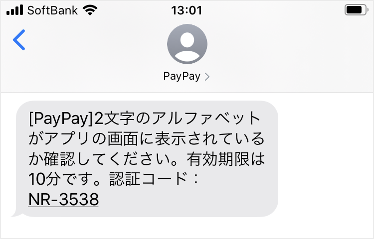
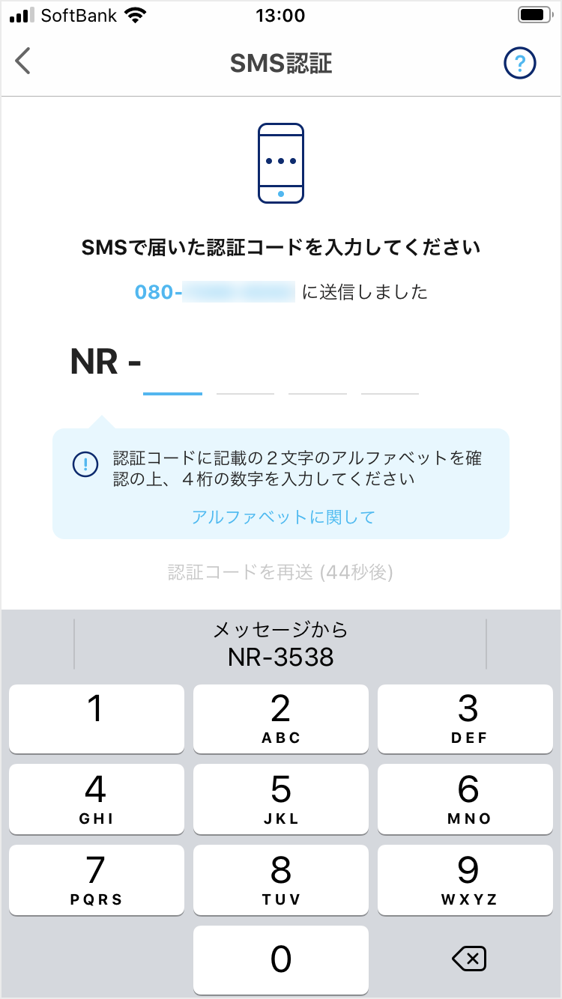
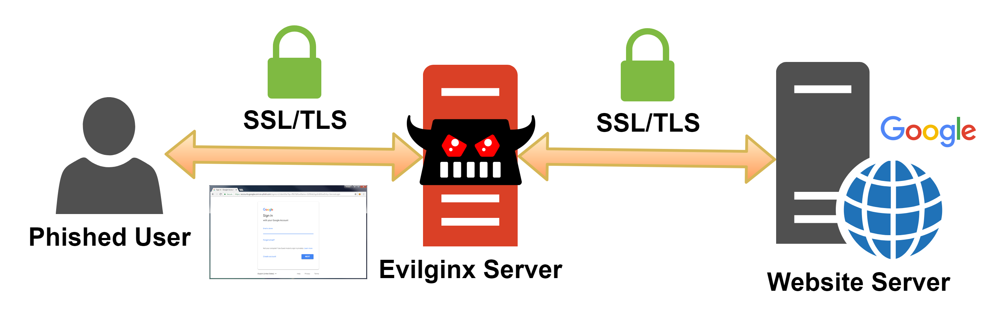
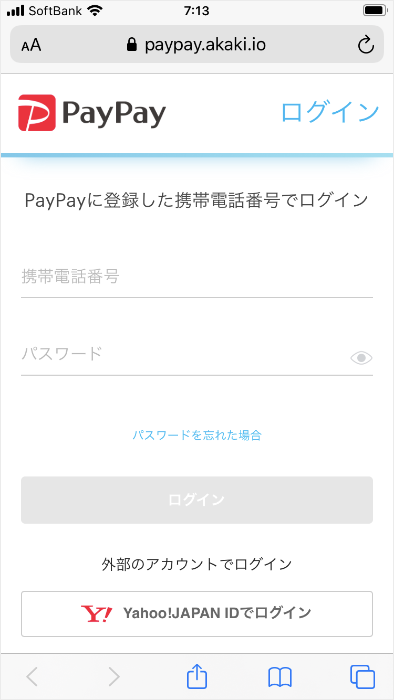
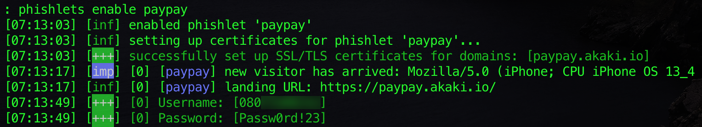
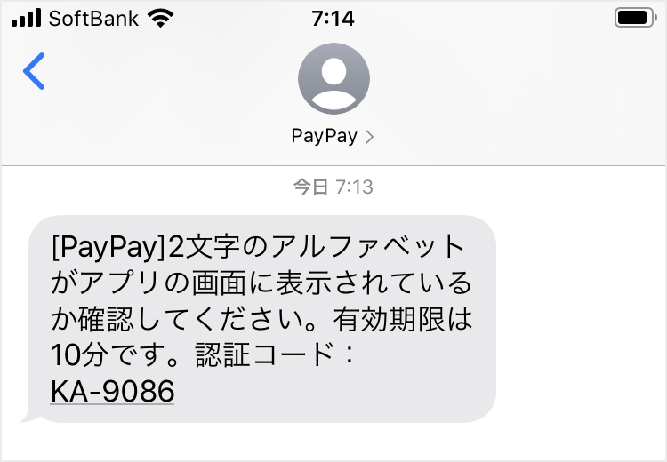

# Evilginx2によるPayPayのSMS認証強化策の回避

国内のオンラインサービスになりすまして2要素認証を回避するMITM（Man-in-the-Middle）フィッシングが確認されている¹。そのような中で、キャッシュレス決済サービス「PayPay」は、第三者によるSMS認証コードの不正利用を防止するための強化策を導入した²。この強化策の仕組みに対して、私はリバースプロキシ型のMITMフィッシングへの耐性に疑問を抱いたため、実際に検証しようと考えた。

## 要約

リバースプロキシ型のMITMフィッシングによりPayPayのSMS認証強化策を回避できた。PayPayの強化策は、SMSで送られる文字と入力フォームに表示される文字を照合することで、正規の入力フォームであることを利用者が判断できる仕組みである。この仕組みの耐性を検証するため、リバースプロキシ型のMITMフィッシングフレームワーク「Evilginx2」を利用して、PayPayのフィッシングサイトを構築した。構築したフィッシングサイトは正規サイトの表示を完全に複製することで、強化策として導入された文字を一致させた。そのため、利用者には文字の一致に基づいて正規と判断するのではなく、メールやSMSに記載されたリンクからはログインしないといった基本姿勢が求められる。

## PayPayの強化策の仕組み

PayPayが考案したSMS認証強化策は、SMSで送られる認証コードの前方にランダムな2文字のアルファベットを記載する。認証コードの入力フォームの前方にも同じ2文字を表示して、それらの文字を利用者に照合させる。文字が一致していれば正規の入力フォームであり、不一致や文字が表示されていなければ偽の入力フォーム、つまりフィッシングサイトであると判断できる。このように、利用者がフィッシングサイトに気づける仕組みをPayPayは導入した。

## Evilginx2による強化策の回避

PayPayのフィッシングサイトの構築には、MITMフィッシングフレームワークである「[Evilginx2](https://github.com/kgretzky/evilginx2)」を利用した。Evilginx2は被害者のブラウザと正規サイトの間でリバースプロキシとして動作し、正規サイトになりすまして認証情報やセッショントークンをキャプチャする³。正規サイトとのセッションを維持することで、パスワード認証後のOTPによる2要素認証も回避できる。同様のツールとして「[Modlishka](https://github.com/drk1wi/Modlishka)」や「[Muraena](https://github.com/muraenateam/muraena)」も知られているが、構築の容易性や更新状況を考慮してEvilginx2を選択した。

検証では、AWSのEC2でEvilginx2を動作させてフィッシングサイトを構築した。Evilginx2が動作するEC2に紐付けたURL `https://paypay.akaki.io/` はPayPayのログインページ `https://www.paypay.ne.jp/app/account/sign-in` を完全に複製する。私のPayPayアカウントの携帯電話番号とパスワードを入力するとEvilginx2にキャプチャされた。なお、EC2へのインバウンドは私のIPアドレスのみを許可し、一般利用者が誤ってフィッシングサイトにアクセスしないよう制御している。

Evilginx2は正規サイトとのセッションを維持することで、パスワード認証後のページも複製する。そのため、フィッシングサイトが表示する2文字のアルファベットは正規の文字となる。SMSで送られた認証コードの前方2文字とも一致することから、PayPayのSMS認証強化策を回避できたと判断した。認証コードを入力するとEvilginx2にキャプチャされ、ログイン成功時に発行されるセッショントークンもログに記録された。なお、セッショントークンの有効性はPayPayのブラウザ支払いから確認している。

## 現実的な詐欺シナリオと対策

詐欺師はメールやSMSで被害者にリンクを送りつけ、正当な理由をかたってフィッシングサイトへ誘導する。例えば、詐欺師はPayPayの運営になりすまして「あなたのアカウントが不正利用されている」という主旨のSMSを送りつけ、被害者にパスワードを変更するようリンクからのログインを促す。被害者がフィッシングサイトに認証情報を入力すると、PayPayからSMSで認証コードが送られてくる。認証コードと入力フォームの前方2文字が一致するため、被害者はフィッシングサイトに気づかない。iPhoneではSMSパスコード自動入力がフィッシングサイトでも機能することから、被害者は認証コードを容易に入力できてしまう。なお、SoftBank回線ではPayPayから送られるSMSの送信元表記が `PayPay` となるため、詐欺師は送信者IDを偽装することで正規のSMSと同じスレッドにフィッシングメッセージを混入できる⁴。



このようなフィッシング詐欺に対して利用者ができる対策のひとつは、身に覚えのないメールやSMSで送られてきたリンクにアクセスしないことである。メールやSMSの内容がキャッシュバックのような魅力的な告知であったり、不正利用疑いのような不安に感じる警告であっても、反射的にリンクにアクセスしない。アカウントの状態を確認する場合は、リンクからではなく公式アプリからのログインを徹底する。また、フィッシング詐欺の手口はログインを求めるだけでなく、個人情報やクレジットカード情報の入力や、添付ファイルの開封やアプリのインストールを求める手口も確認されている。身に覚えがなければ無視したり、判断に迷うようであれば公式サポートに問い合わせたりすることも被害の防止につながる。

## 所感

MITMフィッシングへの対策は利用者の意識に頼るだけでなく、事業者によるFIDO認証の導入といった抜本策も必要だと考える。昨今のフィッシング詐欺は正規サイトの完全な複製にとどまらず、メッセージの送信元やリンクも巧妙に偽装する。そのため利用者がフィッシングを見抜くのは困難になりつつある。そこで、フィッシングによる認証情報の盗用を防止する策として「FIDO（Fast IDentity Online）」が注目されている。FIDOは、パスワードのような認証情報をサーバーへ送信して本人認証するのではなく、顔や指紋といった生体情報や所持するデバイスに基づいてクライアントで本人認証し、認証結果のみをサーバーへ送信する認証方式である。クライアントでの本人認証の前にサーバーの正当性を検証するため、フィッシングサイトでは本人認証自体が開始されない。FIDOの先駆けとして、2017年にGoogleは全ての従業員の認証にU2Fデバイスを導入することで、その年のフィッシングによるアカウントの乗っ取り被害を0件に抑えた⁵。また、FIDO2の導入によりEvilginx2への耐性を実証した例もある⁶。今後のFIDOの普及と、それによるフィッシング詐欺被害の減少に期待したい。

¹ [LINE Phishing Scam steals your SMS authentication code - ozuma5119](https://medium.com/@ozuma5119/line-phishing-scam-steals-your-sms-authentication-code-ee8b83585b81)  
² [「PayPay」のSMS認証機能のセキュリティー強化について - PayPay](https://about.paypay.ne.jp/pr/20200624/01/)  
³ [Evilginx 2 - Next Generation of Phishing 2FA Tokens](https://breakdev.org/evilginx-2-next-generation-of-phishing-2fa-tokens/)  
⁴ [SMSで送信元を偽装したメッセージを送る - Akaki I/O](../2019/sms_spoofing.md)  
⁵ [Google: Security Keys Neutralized Employee Phishing - Krebs on Security](https://krebsonsecurity.com/2018/07/google-security-keys-neutralized-employee-phishing/)  
⁶ [Defeating Phishing with FIDO2 for ASP.NET - IdentityServer](https://www.identityserver.com/articles/defeating-phishing-with-fido2-for-aspnet)

