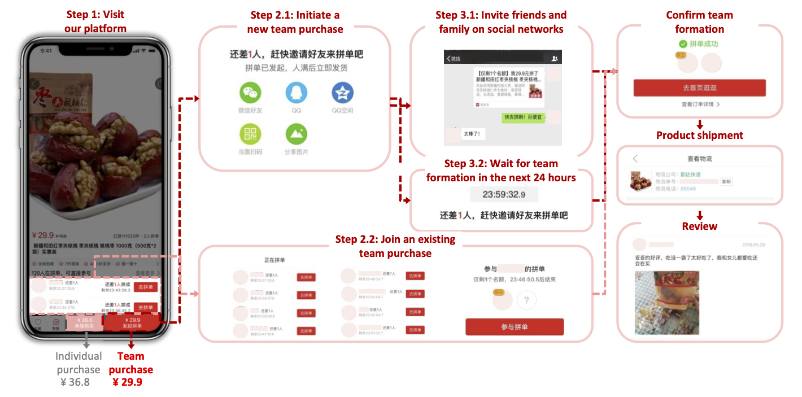

# 共同購入型ソーシャルECでのフィッシング詐欺の手口

中国のEC市場ではSNS要素を取り入れたソーシャルECが台頭している。なかでも共同購入型のソーシャルEC「拼多多（Pinduoduo）」は、設立から5年で時価総額が10兆円を超え、6億人以上のアクティブユーザーを獲得するなど著しい成長を遂げている¹。このような拼多多の急速な成長は今後、世界中の企業に模倣されるとY Combinatorは予見している²。もし日本でも共同購入型のソーシャルECが普及すれば、中国で起きた共同購入にまつわる詐欺が日本でも発生する恐れがある。そこで、拼多多での共同購入の仕組みと中国での詐欺事例を参考に、日本で起こりうる詐欺の手口を把握したいと考えた。

中国の共同購入型ソーシャルECでは、詐欺師が消費者に接触しやすい環境が整っていた。拼多多の普及により、消費者は自分のSNSアカウントを利用して、共同購入への招待リンクを知人同士で送り合うようになった。さらに消費者たちはSNS上のグループチャットで招待リンクを共有し、他人同士で共同購入し合うようにもなった。その結果、詐欺師は偽の招待リンクを利用して、消費者をフィッシングサイトへ誘導する手口が可能になった。

## SNSを利用した共同購入の募集

拼多多の共同購入は、消費者自らがSNSを利用して共同購入者を募る仕組みである。24時間以内に既定の人数を集めると共同購入が成立し、定価より安い値段で商品を購入できる。既定の人数を集めるにはWeChatやQQなどのSNSを利用して、家族や友人に共同購入への招待リンクを共有する³。消費者自身の人間関係を生かして共同購入を成立させる仕組みになっている。

このような仕組みを応用し、消費者たちは他人同士でも共同購入し合うためた、SNS上のグループチャットで招待リンクを共有するようになった。拼多多の共同購入グループに参加するには、WeChatやWeiboで「拼多多互助群」と検索してグループのQRコードをスキャンする。実際にWeChatのグループに参加すると、共同購入への招待リンクが頻繁に投稿されていた。

## 共同購入グループに潜む罠

誰でも自由に参加できる共同購入グループの中には詐欺師も潜んでおり、購入意欲のありそうな消費者を狙っている。一般的なB2CのECプラットフォームでは、消費者の購入意欲が第三者に知られることはなく、第三者が消費者に接触できる機能も備わっていない。しかし、拼多多はSNSを利用して共同購入を募る仕組みであり、他人同士で共同購入し合うグループもSNS上に形成された。そのため詐欺師は共同購入を募るふりをして消費者に接触できるようになった。

中国の事例をみると、詐欺師は共同購入への招待をかたる偽のリンクをグループチャットに投稿し、消費者をフィッシングサイトへ誘導していた。甘粛省鎮原県の裁判所が報じた2019年8月の事例では、フィッシングサイトにアクセスした被害者はAlipayの認証情報を要求された⁴。認証情報を入力した被害者のAlipayからは合計5300元（約8万円）が詐欺師によって引き出された。警察は消費者に対し、SNS上のグループで共同購入する際は、認証情報や個人情報を安易に入力しないよう注意を呼び掛けている。

## 所感

拼多多の立場から消費者保護を考えると、他社が提供するSNS上で起こる詐欺を察知するのは容易ではない。WeChatとQQを提供するテンセントは、拼多多株の29.2％を保有する主要株主でもある¹。しかし、関連会社同士とはいえテンセントが提供するSNSのグループチャットに投稿される内容を、拼多多の安全対策チームが監視できるとは考えにくい。中国の詐欺事例では、被害者は拼多多の消費者でありWeChatの消費者でもある。そのため、SNSとECの運営会社が異なるソーシャルECでは、消費者保護を目的とした会社間の連携が必要だと考える。

¹ [時価総額10兆円を突破　新興EC「拼多多」急成長の背後にあるビジネスロジックとは - 36Kr Japan](https://36kr.jp/80619/)  
² [Pinduoduo and the Rise of Social E-Commerce - Y Combinator](https://www.ycombinator.com/library/2z-pinduoduo-and-the-rise-of-social-e-commerce)  
³ [Pinduoduo Overview - Pinduoduo Inc.](https://pinduoduo.gcs-web.com/static-files/468b2c9f-9112-410d-84b3-2b22e07c7ee0)  
⁴ [净网2019|拼多多砍价免费拿，请从我的朋友圈消失 - 甘肃镇原法院](https://mp.weixin.qq.com/s/qv6_WPzGGU5s9BF5xiVh7Q)  

