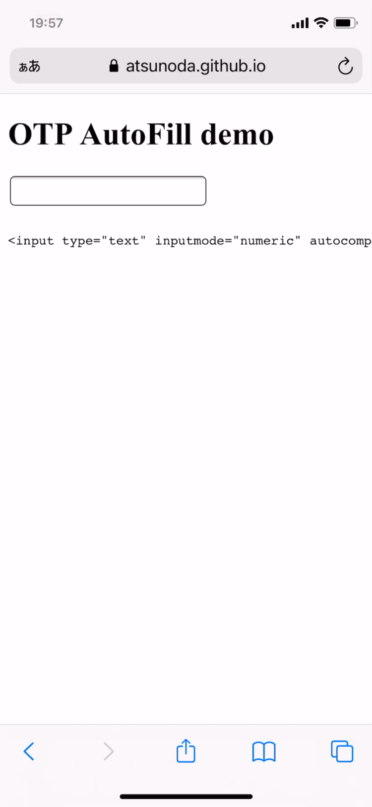
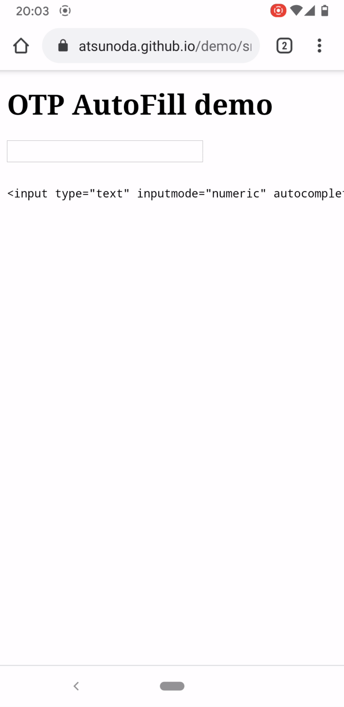
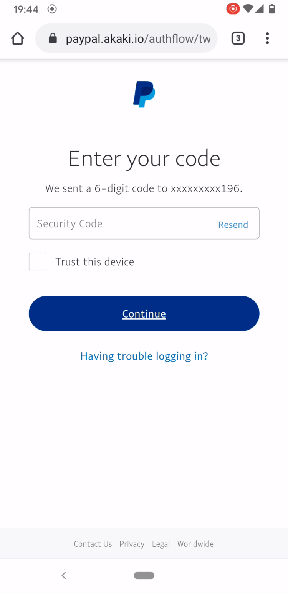
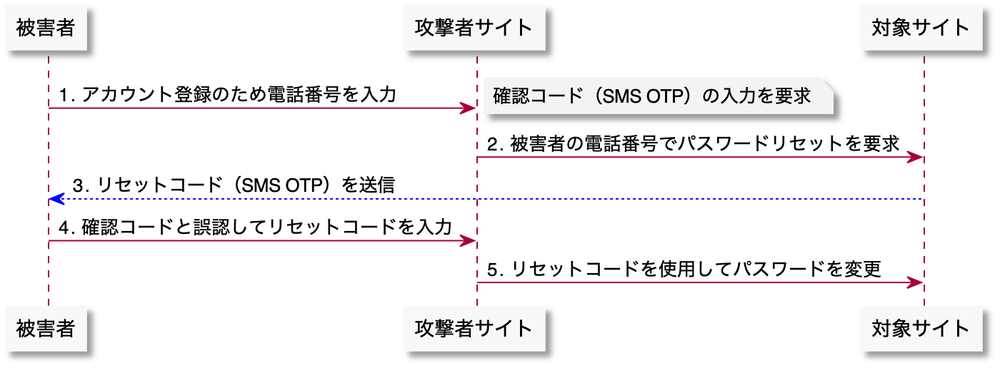
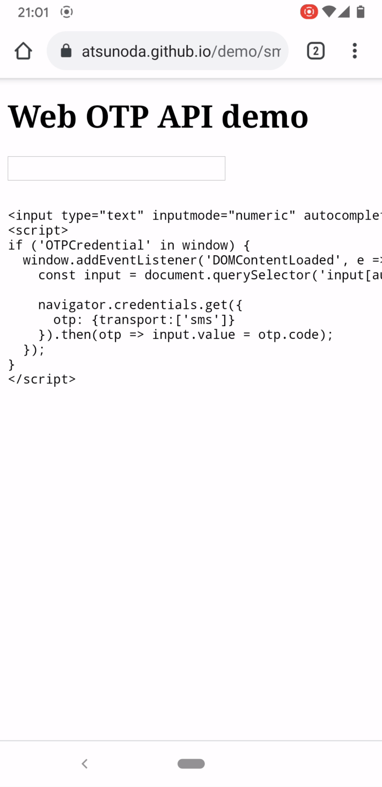
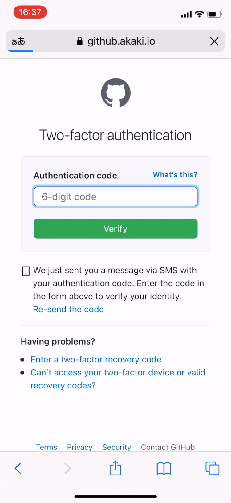

# SMS OTPの自動入力によるリスクとその対策

iOS 12以降にはSMSで送られるワンタイムパスワード（以下、SMS OTP）を自動入力する機能が搭載されている¹。前回の記事でMITMフィッシングを検証した際に、この機能によって正規のSMS OTPが偽サイトへ自動入力された。この挙動に違和感を覚えたため、自動入力の仕組みを理解したいと考えた。Androidの自動入力も含めて検証し、SMS OTPとWebサイトが紐付かない状態での自動入力によるリスクとその対策を調査した。

## 要約

SMS OTPとWebサイトを紐付けるための提案仕様を導入することで、フィッシングサイトへの自動入力を防止できる。iOSとAndroidにはSMSメッセージからOTPをヒューリスティックに抽出し、自動入力する機能が標準で搭載されている。しかし、標準の機能ではSMS OTPとWebサイトの紐付きを確認せずに自動入力する。これにより、MITMフィッシングによる2要素認証の回避だけでなく、意図しないパスワード変更のリスクにもつながる。このようなリスクへの対策として、SMS OTPとWebサイトを紐付けるための仕様が提案されている。この仕様を既に導入しているサービスで検証し、正規のSMS OTPと紐付かない偽サイトでは自動入力が発動しないことを確認した。

## iOSとAndroidにおけるSMS OTPの自動入力

iOSとAndroidに標準で搭載されているSMS OTPの自動入力は、SMSメッセージに含まれるOTPをヒューリスティックに（推測に基づいて）抽出して入力する。Appleの開発者ドキュメントでは、SMS OTPを自動入力させたいWebサイトのinputフォームに `autocomplete="one-time-code"` を設定するよう指示している²。この設定値はOTPの自動入力を示唆するものであり、Web標準であることから主要なブラウザでサポートされている³。そこで、以下のHTMLを含むサイトAを構築し、iOSとAndroidでのSMS OTPの自動入力を検証する。

[https://atsunoda.github.io/demo/sms\_otp\_autofill/one-time-code.html](https://atsunoda.github.io/demo/sms_otp_autofill/one-time-code.html)

```markup
<input type="text" inputmode="numeric" autocomplete="one-time-code" />
```

### iOSの自動入力

AppleはWWDC 2018で自動入力の仕組みを解説した際に、SMSメッセージに含まれる `code` や `passcode` といった単語の周辺からOTPを見つけ出すと述べている⁴。そこで、`Your code is 123456.` というSMSメッセージをTwilioから送信し、iOSの自動入力が発動するか検証する。iOS 14.4のSafariからサイトAを開いた状態でSMSを受信すると、OTPの値である `123456` が入力候補としてキーボード上部に表示され、その値をフォームへ自動入力できた（図1）。デフォルトブラウザに設定していないiOS版のChrome 87とFirefox 30を使用した場合も自動入力が発動した。



### Androidの自動入力

Androidではメッセージアプリの受信通知からSMS OTPをワンタップでコピーでき⁵、Android 11以降ではコピーした値を入力候補としてキーボード上部に表示する⁶。Android 11のChrome 88を使用して同様に検証すると、受信通知からコピーした値が入力候補として表示され、その値をフォームへ自動入力できた（図2）。iOSと比べると値をコピーする手間は増えるが、AndroidでもSMS OTPの自動入力は可能であった。デフォルトブラウザに設定していないAndroid版のFirefox 85を使用した場合も自動入力が発動した。



### 日本語のSMSメッセージでの挙動

iOSに搭載されるSMS OTPの自動入力は日本語のSMSメッセージにも対応している。前回の検証では、PayPayから送信されたSMSメッセージは日本語であり、`code` などの英単語を含んでいなくても自動入力が発動した。そこで、国内のサービスのSMS認証で使用されていたOTPを意味する日本語を参考に、日本語のメッセージからOTPを抽出する際のヒューリスティックを検証する。OTPを意味する日本語の単語として `コード` と `番号` の2単語と、それらに `確認` と `認証` 、`セキュリティ` の3単語を複合した計8通りで検証すると、iOSとAndroidでは以下の表に示すような挙動の違いが見られた。iOSでは `コード` または `認証番号` を含めた5通りで自動入力が発動したが、Androidでは日本語のメッセージでの発動を確認できなかった。

| SMSメッセージ | Safari on iOS 14.4 | Chrome 88 on Android 11 |
| :--- | :---: | :---: |
| `あなたのコードは123456です。` | 発動 | 不発 |
| `あなたの確認コードは123456です。` | 発動 | 不発 |
| `あなたの認証コードは123456です。` | 発動 | 不発 |
| `あなたのセキュリティコードは123456です。` | 発動 | 不発 |
| `あなたの番号は123456です。` | 不発 | 不発 |
| `あなたの確認番号は123456です。` | 不発 | 不発 |
| `あなたの認証番号は123456です。` | 発動 | 不発 |
| `あなたのセキュリティ番号は123456です。` | 不発 | 不発 |

## フィッシングサイトへの自動入力のリスク

SMS OTPとWebサイトが紐付かない状態では、正規のSMS OTPがフィッシングサイトへ自動入力されるリスクが生じる。現実的なリスクとして、GutmannらはMITMと組み合わせた「ログインにおける2要素認証の回避」と「ソーシャルログインの偽装による電話番号確認の回避」、「オンライン決済における取引認証の回避」の3つのシナリオを示している⁷。2要素認証の回避につながるリスクは、iOSの自動入力がPayPayの偽サイトで発動した前回の検証で確認している。今回の検証ではAndroidの自動入力がPayPalの偽サイトで発動するか確認する。

### 2要素認証の回避

PayPalの偽サイトは前回と同様にMITMフィッシングフレームワーク「Evilginx2」で複製し、一般利用者が誤ってアクセスしないようインバウンド接続を制御した。Android 11のChrome 88から複製した偽サイトにPayPalアカウントでログインすると、2要素認証に必要なSMS OTPがPayPalから送信される。その受信通知からOTPをコピーして、キーボードの入力候補から偽サイトへ自動入力できた（図3）。なお、PayPayとPayPalのinputフォームには `autocomplete="one-time-code"` が設定されていなかったが、iOSとAndroidの自動入力は発動した。



### PRMitM攻撃への支援

SMS OTPとWebサイトが紐付かない状態での自動入力はPRMitM攻撃への支援にもなりうる。「PRMitM（Password Reset Man-in-the-Middle）」は、Gelernterらが提案したアカウント登録とパスワードリセットの類似性を悪用して被害者のアカウントを乗っ取る攻撃である⁸。PRMitM攻撃のシナリオは、まず攻撃者はアカウント登録を促すサイトへ被害者を誘導し、被害者が対象サイトのアカウントに登録している電話番号を入力させる（図4 1）。攻撃者サイトでは電話番号確認に必要な確認コードの入力を求めておき、その裏で攻撃者は対象サイトのパスワードリセットに被害者の電話番号を入力する（図4 2）。被害者は対象サイトから送られてきたリセットコード（図4 3）を、攻撃者サイトで求められている確認コードと誤認して入力する（図4 4）。攻撃者は入手したリセットコードを使用して、被害者が所有する対象サイトのアカウントのパスワードを変更する（図4 5）。このようなシナリオにおいて、対象サイトが発行したリセットコードを攻撃者サイトへ自動入力することが攻撃成功率を高める要因になると考える。ただし、リセットコードの入力方法を「自動入力」と「手入力」、「コピー&ペースト」で比較した柴山らの研究では有意差は認められていない⁹。



## SMS OTPとWebサイトを紐付ける仕様

フィッシングサイトへの自動入力を防ぐためにSMS OTPとWebサイトを紐付ける仕様が、W3CのコミュニティグループであるWICGで提案されている。AppleとGoogleが提案する「[Origin-bound one-time codes delivered via SMS](https://wicg.github.io/sms-one-time-codes/)（以下、Domain-bound codes）」は、OTPの値とそれを発行したWebサイトのドメインを機械的に抽出するためのSMSメッセージのフォーマットを定義する。さらに、このフォーマットに従って抽出したOTPをドメインが一致するWebサイトへ入力するためのJavaScript APIを、Googleが「[Web OTP API](https://wicg.github.io/web-otp/)」として提案している。

### SMSメッセージのフォーマット仕様

Domain-bound codesが定義するフォーマットは、最初の行にヒューマンリーダブルなテキストを記載でき、最後の行の `@` 以降にOTPを発行した（OTPを入力すべき）Webサイトのドメインを、`#` 以降にOTPの値を記載する。例えば、以下のSMSメッセージは `akaki.io` に入力すべきOTPの値が `123456` であることを示している。AppleはiOS 14からDomain-bound codesに準拠した独自の自動入力を提供している¹⁰。そのため、以下のSMSメッセージを受信したiOS 14以降のデバイスは、ドメインが `akaki.io` と一致するWebサイトにのみOTPを自動入力する。ドメインが `atsunoda.github.io` であるサイトAでは自動入力が発動しない（図5）。

```markup
あなたの確認コードは123456です。

@akaki.io #123456
```


### 自動入力するためのAPI仕様

Web OTP APIは、受信したSMS OTPをブラウザが取得するためのJavaScript APIである¹¹。Web OTP APIを搭載したブラウザはDomain-bound codesに準拠したSMSメッセージにアクセスし、`#` 以降に記載されたOTPの値を抽出する。抽出した値は `OTPCredential` オブジェクトに格納し、`@` 以降のドメインと一致するWebサイトからのみ `navigator.credentials.get()` メソッドでの取得を許可する。このメソッドを使用したサイトBを以下に構築し、Web OTP APIによるSMS OTPの自動入力を検証する。

[https://atsunoda.github.io/demo/sms\_otp\_autofill/web-otp-api.html](https://atsunoda.github.io/demo/sms_otp_autofill/web-otp-api.html)

```markup
<input type="text" inputmode="numeric" autocomplete="one-time-code" />
<script>
if ('OTPCredential' in window) {
  window.addEventListener('DOMContentLoaded', e => {
    const input = document.querySelector('input[autocomplete="one-time-code"]');

    navigator.credentials.get({
      otp: {transport:['sms']}
    }).then(otp => input.value = otp.code);
  });
}
</script>
```

Web OTP APIはAndroid上のChrome 84以降で利用できる¹³。検証では、Android 11のChrome 88からサイトBを開いた状態で、ドメインが不一致の `@akaki.io` と、一致する `@atsunoda.github.io` を記載したSMSメッセージを受信した場合の挙動を確認する。どちらの場合もSMSメッセージを受信すると、Chromeがメッセージを読んでOTPを入力することへの許可を求められるが、自動入力されるのはドメインが一致する場合だけだった（図6）。Androidでは日本語のメッセージだとヒューリスティックによる自動入力が発動しなかったが、Web OTP APIによる自動入力は発動した。なお、サイトBではOTPをinputフォームに入力するだけだが、実装によっては入力後にsubmitボタンを自動押下したり、OTPを直接サーバーへ送信したりすることも可能である。SMS OTPのフォーム実装のベストプラクティスをGoogleが示している¹²。



### 仕様の導入事例

これらの仕様は現時点では提案段階だが、一部のサービスに導入され始めている。例えば、マッチングサービス「Tinder」やホテル予約サービス「OYO」はWeb OTP APIを導入しており、TwitterやFacebookも導入の準備を進めている¹⁴。また、GitHubはフィッシング対策の一環としてDomain-bound codesを導入している¹⁵。GitHubのSMS OTPは以下のようなフォーマットで送信されるため、iOS 14以降のデバイスは正規のSMS OTPを偽サイトへ自動入力しない（図7）。

```markup
541968 is your GitHub authentication code.

@github.com #541968
```



## 所感

公衆交換電話網におけるリスクを考慮する必要があることから、SMS認証はNIST SP 800-63Bで制限付きの認証方法とされている¹⁶。それでもパスワードだけの知識認証に比べれば、SMSによる2要素認証の導入によりアカウント乗っ取りの防止は期待できる。Googleの調査では、ばらまき型のフィッシングによる乗っ取りの96%をSMS認証で防げている¹⁷。不正対策への需要の高まりもあり、FIDOのような画期的な認証方法が普及するまではSMS認証が利用され続けると考える。自動入力の進歩によりSMS OTPを正規のWebサイトにワンタップで入力できるようになれば、安全性だけでなく利便性も向上する。実際に、Web OTP APIを導入したOYOでは、SMS認証を介したログインにかかる時間を37%も短縮できている¹⁸。モバイルアプリへの導入や主要ブラウザでの対応も含め、SMS OTPの自動入力の標準化に向けた今後の動向を注視したい。


¹ [iPhoneでSMSのパスコードを自動入力する - Apple](https://support.apple.com/ja-jp/guide/iphone/iphc89a3a3af/ios)  
² [Enabling Password AutoFill on an HTML Input Element - Apple Developer](https://developer.apple.com/documentation/security/password_autofill/enabling_password_autofill_on_an_html_input_element)  
³ [Autofilling form controls: the autocomplete attribute - HTML Living Standard](https://html.spec.whatwg.org/multipage/form-control-infrastructure.html#attr-fe-autocomplete-one-time-code)  
⁴ [Automatic Strong Passwords and Security Code AutoFill - Apple Developer](https://developer.apple.com/videos/play/wwdc2018/204/?time=1572)  
⁵ [Android Messages 3.2 adds 2FA code copy shortcuts - Android Police](https://www.androidpolice.com/2018/05/11/android-messages-3-2-adds-2fa-code-copy-shortcuts-apk-download/)  
⁶ [Android 11 makes autofill more seamless with keyboard integration - XDA Developers](https://www.xda-developers.com/android-11-seamless-autofill-keyboard-integration/)  
⁷ [Taken Out of Context: Security Risks with Security Code AutoFill in iOS & macOS - WAY 2019](https://wayworkshop.org/2019/papers/way2019-gutmann.pdf)  
⁸ [The Password Reset MitM Attack - IEEE Symposium on Security and Privacy 2017](https://ieeexplore.ieee.org/stamp/stamp.jsp?tp=&arnumber=7958581)  
⁹ [多要素認証を悪用したパスワードリセット手法PRMitM攻撃の被害を増加させる新たな要因の調査 - 情報処理学会](http://id.nii.ac.jp/1001/00205528/)  
¹⁰ [Enhance SMS-delivered code security with domain-bound codes - Apple Developer](https://developer.apple.com/news/?id=z0i801mg)  
¹¹ [Verify phone numbers on the web with the Web OTP API - web.dev](https://web.dev/web-otp/)  
¹² [SMS OTP form best practices - web.dev](https://web.dev/sms-otp-form/)  
¹³ [Chrome 84 Beta: Web OTP, Web Animations, New Origin Trials and More - Chromium Blog](https://blog.chromium.org/2020/05/chrome-84-beta-web-otp-web-animations.html)  
¹⁴ [SMS OTP form best practices - YouTube, Google Chrome Developers](https://www.youtube.com/watch?v=sU4MpWYrGSI&t=427)  
¹⁵ [Phishing Resistant SMS Autofill - GitHub Blog](https://github.blog/2020-09-25-phishing-resistant-sms-autofill/)  
¹⁶ [5.1.3.3 Authentication using the Public Switched Telephone Network - NIST SP 800-63B](https://pages.nist.gov/800-63-3/sp800-63b.html#-5133-authentication-using-the-public-switched-telephone-network)  
¹⁷ [New research: How effective is basic account hygiene at preventing hijacking - Google Security Blog](https://security.googleblog.com/2019/05/new-research-how-effective-is-basic.html)  
¹⁸ [Implementing auto read sms capability on web: WebOTP - OYOTech](https://medium.com/oyotech/implementing-automatic-sms-verification-for-websites-oyo-9375feba0749)

